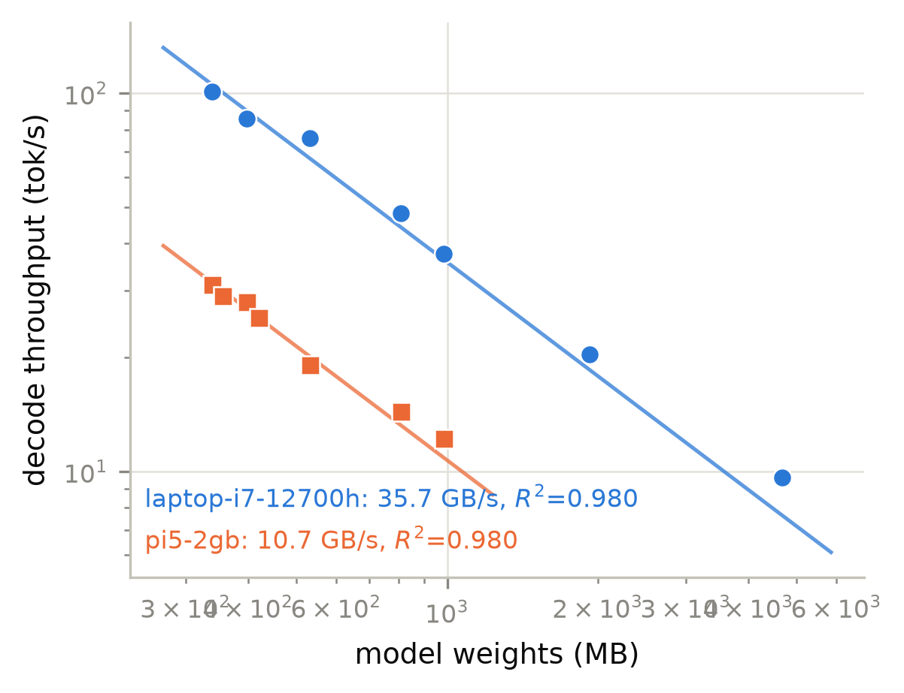

# ML Systems Lab

A reproducible benchmarking framework for ML inference across heterogeneous hardware:
laptops, single-board computers, and servers, from one config file and one command.

```
mlsys run configs/llm-matrix.yaml
mlsys report runs/llm-matrix --full
```

Every run produces a self-describing JSON record carrying the hardware, OS, kernel,
compiler, backend version, model, quantization, the measured metrics, and the physical
state of the machine while they were measured (power, temperature, clocks, throttle
flags, CPU utilization). The analysis layer turns a directory of records into
publication-quality tables (text, Markdown, LaTeX/booktabs) and figures.

Built and used for a real research program: the records under `results/paper12/` are the
measurements behind an IEEE Transactions on Computers submission, and the framework
reproduces that paper's published roofline fits exactly (Pi 5: 10.7 GB/s effective,
R^2 = 0.980; i7-12700H: 35.7 GB/s, R^2 = 0.980).



## What it measures

| Metric | How |
|---|---|
| TTFT (time to first token) | streaming request against `llama-server`, first-chunk timing |
| Prefill / decode throughput | `llama-bench`, parsed from its JSON output |
| End-to-end request latency | same streaming path, submit to last token |
| Single-inference latency (mean, p50/p95/p99) | ONNX Runtime, timed in-process on the device |
| Memory | peak RSS, plus free-memory and swap state around every run |
| CPU utilization | `/proc/stat` deltas (Linux), `GetSystemTimes` (Windows), per-core where available |
| Temperature and throttling | sysfs thermal zones, Pi throttle bitmask, in the record not a side file |
| Power and energy | Raspberry Pi PMIC per-rail (core vs DRAM split), Intel RAPL where present |
| Derived | decode bandwidth, roofline utilization %, energy per token |

Anything a platform cannot measure is reported as absent, never as zero.

## Devices exercised

| Device | Route | Notes |
|---|---|---|
| Raspberry Pi 5 (2 GB, Cortex-A76) | SSH agent | PMIC per-rail power, throttle bits, DVFS control |
| i7-12700H laptop (Windows) | local agent | 20-thread sweeps, up to 7B models |
| RTX 3050 (same laptop) | ONNX Runtime DirectML | modeled as its own device; at batch 1 the GPU loses to the CPU (12.3 ms vs 3.0 ms, dispatch overhead), at batch 64 it wins 29x (9,885 vs 338 inf/s), and both facts come out of the same config file |

A new machine is a config block, not code: `host`, an SSH key, and the paths to its
models. A new accelerator is a device entry pointing at an interpreter whose ONNX
Runtime carries the right execution provider.

## Design

```
config.yaml ──> RunSpecs ──> Device ──> agent (on the device) ──> RunRecord ──> analysis
                             │
                             ├── LocalDevice   (this machine, agent as subprocess)
                             └── SSHDevice     (agent pushed over SSH, runs remotely)
```

* **The agent runs on the device under test**, so the benchmark and the telemetry
  sampler are colocated; nothing crosses the network inside a measurement window.
  It is pure standard library and is copied, not installed.
* **Backends** (`llamacpp`, `onnxruntime`) turn one spec into one task and parse one
  result. The agent returns raw output; parsing happens on the host, so a parser bug is
  fixed by re-parsing stored output rather than re-running a campaign.
* **Run ids are deterministic** over the spec, so an interrupted campaign resumes by
  skipping what is already on disk (`--no-resume` to override). Failures are records
  too, with the error and the raw output preserved.
* **Capability model**: each device reports what it can measure (`mlsys probe`), and
  sweeps degrade gracefully rather than failing on a machine without, say, a PMIC.

## Install

```
pip install -e ".[dev]"        # numpy, matplotlib, PyYAML; pytest for the test suite
pip install -e ".[onnx]"       # optional: onnxruntime for the ORT backend on this host
```

The measurement core (agent, devices, backends, config, schema) is standard library
only, verified by a dedicated no-dependencies CI job. Devices under test need Python 3.9+
and their inference backend (a llama.cpp build and/or onnxruntime), nothing else.

## Quick start

1. Describe your machines and models once:

```yaml
# configs/lab.yaml
experiment: my-sweep
devices:
  laptop:
    kind: local
    dram_peak_GBs: 53.9            # your measured read ceiling; drives utilization %
    llamacpp: { bin_dir: C:/llmpc/bin }
  pi5:
    host: 100.98.217.64            # any SSH-reachable box; Tailscale IPs work fine
    user: manu
    identity_file: ~/.ssh/raspberry_pi_key
    dram_peak_GBs: 13.98
    llamacpp: { bin_dir: ~/llm/llama.cpp/build/bin }
models:
  qwen0.5b-q4km:
    quantization: Q4_K_M
    paths: { laptop: C:/llmpc/models/qwen0.5b-q4km.gguf, pi5: ~/llm/models/qwen0.5b-q4km.gguf }
defaults: { backend: llamacpp, repetitions: 3 }
matrix:
  - devices: [laptop, pi5]
    models: [qwen0.5b-q4km]
    modes: [throughput]
    threads: [1, 2, 4]
    prompt_tokens: [128]
    output_tokens: [64]
  - devices: [laptop, pi5]
    models: [qwen0.5b-q4km]
    modes: [latency]               # TTFT via llama-server streaming
    threads: [4]
    prompt_tokens: [128, 512]
    output_tokens: [64]
```

2. Check the machines are reachable and see what they can measure:

```
mlsys probe --config configs/lab.yaml
```

3. Preview, then run:

```
mlsys run configs/lab.yaml --dry-run
mlsys run configs/lab.yaml
```

4. Tables and figures:

```
mlsys report runs/my-sweep                 # tables to the terminal
mlsys report runs/my-sweep --format latex  # booktabs, ready to paste
mlsys report runs/my-sweep --full          # REPORT.md + PNG/PDF figures
```

5. Two more tools:

```
mlsys membw --device pi5 --config configs/lab.yaml
    # measures the device's achievable DRAM read ceiling and prints the
    # dram_peak_GBs line to put in the config, with a stability check that
    # flags a machine that was not idle

mlsys compare runs/before runs/after --metric decode_tps
    # same workloads in two result sets, side by side with the ratio
```

## Measurement methodology

The rules encoded in this framework, and why, are documented in
[docs/METHOD.md](docs/METHOD.md). The short version:

* benchmark on an idle machine; the framework flags high run-to-run spread,
* never sample power in the run you take throughput from (the sampler perturbs decode),
* temperature and throttle state live inside the record so a hot run cannot be
  silently compared with a cool one,
* `llama-bench` for throughput, `llama-server` streaming for TTFT, and `llama-cli`
  never (it hangs when scripted),
* every failure is written to disk with its raw output.

## Repository layout

```
src/mlsyslab/
  schema.py          the RunRecord and its loader
  sysinfo.py         automatic hardware/OS description
  config.py          YAML/JSON sweep expansion
  runner.py          resumable execution, atomic writes
  agent.py           the on-device payload (stdlib only)
  bench_onnx.py      the on-device ONNX Runtime benchmark
  devices/           local and SSH devices, capability model
  backends/          llamacpp (bench + server) and onnxruntime
  telemetry/         power (PMIC/RAPL), thermal, CPU, DVFS
  analysis/          dataset, tables, figures, REPORT.md
configs/             experiment definitions
tools/               result backfill converters
results/paper12/     real measurements from the IEEE TC submission
tests/               65 hardware-free tests (recorded fixtures)
```

## License

MIT. llama.cpp and ONNX Runtime are invoked as external tools and are licensed by their
respective projects.
