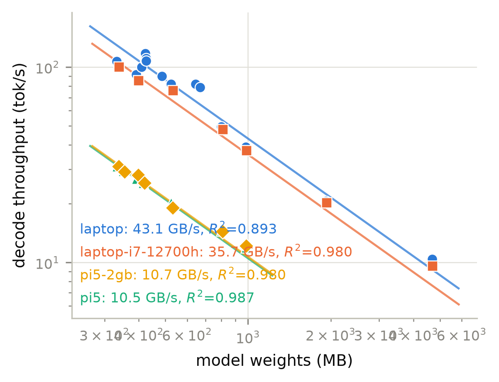

# ML Systems Lab

[](https://github.com/manunicholasjacob/ml-systems-lab/actions/workflows/ci.yml)
[](https://pypi.org/project/ml-systems-lab/)
[](https://doi.org/10.5281/zenodo.21867055)
[](LICENSE)
[](pyproject.toml)

A reproducible benchmarking framework for ML inference across heterogeneous hardware:
laptops, single-board computers, and servers, from one config file and one command.

```
pip install ml-systems-lab
mlsys run configs/example-smoke.yaml
mlsys report runs/smoke-test --full
```

Every run produces a self-describing JSON record carrying the hardware, OS, kernel,
compiler, backend version, model, quantization, the measured metrics, and the physical
state of the machine while they were measured (power, temperature, clocks, throttle
flags, CPU utilization). The analysis layer turns a directory of records into
publication-quality tables (text, Markdown, LaTeX/booktabs) and figures.

Built and used for a real research program: the records under `results/paper12/` are the
measurements behind a manuscript now under review at the IEEE Internet of Things Journal, and the
framework reproduces that manuscript's roofline fits exactly (Pi 5: 10.7 GB/s effective,
R^2 = 0.980; i7-12700H: 35.7 GB/s, R^2 = 0.980). Two campaigns run natively by this
framework then re-measured the same quantities independently and agreed within 1.7%.

## Statement of need

Comparing inference performance across machines is mostly a bookkeeping problem, and
most of the tooling solves the wrong half of it. `llama-bench` and `onnxruntime_perf_test`
each measure one backend well and report a table with no hardware, no thermal state and
no power in it. MLPerf Inference specifies a rigorous closed-division protocol, but its
submission machinery assumes a datacenter and a submitter, not a Raspberry Pi on a desk.
Neither will tell you six weeks later whether a number was taken on a throttling board,
which compiler produced the binary, or how much of the DRAM ceiling that run reached.

Edge inference is where that gap hurts most, because the answers move with conditions the
usual tools do not record. The same model on the same board decodes differently hot and
cold, at two threads and at four, with the page cache warm and cold, and on the same
silicon under a different quantization format. A result without that context is not
reproducible, and reviewers cannot check it.

`ml-systems-lab` closes the gap by making the context part of the measurement. One YAML
file describes machines, models and a sweep; one command executes it across a mixed fleet
over SSH; and every point comes back as a single self-describing JSON record carrying the
hardware, OS, kernel, backend build commit, model, quantization, the metrics, and the
physical state of the machine while they were taken: per-rail power, temperature, clocks,
throttle flags, memory pressure. Runs are addressed by a deterministic hash of their
specification, so an interrupted campaign resumes and a corrected point re-executes
exactly. Failures are records too, with their raw output kept, so a parser bug is fixed
by reparsing rather than by repeating an overnight campaign.

It was written because five research campaigns had each grown their own copy of the same
harness and the copies had drifted. The framework that replaced them reproduces those
papers' reported fits from their own data, and the datasets it has produced since ship
in `results/` for anyone who wants to check a claim without owning the hardware.



*Every point is a different model or quantization; every line is one device's effective
memory bandwidth. Two independent Pi 5 campaigns (weeks apart, different harnesses) and
two laptop campaigns land on top of each other: decode throughput is model bytes divided
by one number per device.*

## What it measures

| Metric | How |
|---|---|
| TTFT (time to first token) | streaming request against `llama-server`, first-chunk timing |
| Prefill / decode throughput | `llama-bench`, parsed from its JSON output |
| End-to-end request latency | same streaming path, submit to last token |
| Single-inference latency (mean, p50/p95/p99) | ONNX Runtime, timed in-process on the device |
| Memory | peak RSS, plus free-memory and swap state around every run |
| CPU utilization | `/proc/stat` deltas (Linux), `GetSystemTimes` (Windows), per-core where available |
| Temperature and throttling | sysfs thermal zones, Pi throttle bitmask, in the record not a side file |
| Power and energy | Raspberry Pi PMIC per-rail (core vs DRAM split), Intel RAPL where present, NVIDIA GPUs through whichever of three instruments the part supports, named in the record |
| Derived | decode bandwidth, roofline utilization %, energy per token |

Anything a platform cannot measure is reported as absent, never as zero.

## Devices exercised

| Device | Route | Notes |
|---|---|---|
| Raspberry Pi 5 (2 GB, Cortex-A76) | SSH agent | PMIC per-rail power, throttle bits, DVFS control |
| i7-12700H laptop (Windows) | local agent | 20-thread sweeps, up to 7B models |
| RTX 3050 (same laptop) | ONNX Runtime DirectML | modeled as its own device; at batch 1 the GPU loses to the CPU (12.3 ms vs 3.0 ms, dispatch overhead), at batch 64 it wins 29x (9,885 vs 338 inf/s), and both facts come out of the same config file |
| Kubernetes pod (k3s) | `kubectl exec` agent | the same laptop CPU, reached through a container; effective cgroup ceilings are read from inside the pod and travel in the record |

A new machine is a config block, not code: `host`, an SSH key, and the paths to its
models. A new accelerator is a device entry pointing at an interpreter whose ONNX
Runtime carries the right execution provider. A container is a device entry with an
image and a `kubectl`.

## Design

```
config.yaml ──> RunSpecs ──> Device ──> agent (on the device) ──> RunRecord ──> analysis
                             │
                             ├── LocalDevice   (this machine, agent as subprocess)
                             ├── SSHDevice     (agent pushed over SSH, runs remotely)
                             └── K8sDevice     (agent streamed into a pod, runs there)
```

The Kubernetes device is a third implementation of an interface that already existed:
`_invoke_agent`, `push`, `pull`, `resolve`, `exists`, `package_root`, `python_executable`.
No backend changed to accommodate it, and a test fails the build if any backend so much
as mentions a container. That is the design claim, and it is checked rather than
asserted.

* **The agent runs on the device under test**, so the benchmark and the telemetry
  sampler are colocated; nothing crosses the network inside a measurement window.
  It is pure standard library and is copied, not installed.
* **Backends** (`llamacpp`, `onnxruntime`) turn one spec into one task and parse one
  result. The agent returns raw output; parsing happens on the host, so a parser bug is
  fixed by re-parsing stored output rather than re-running a campaign.
* **Run ids are deterministic** over the spec, so an interrupted campaign resumes by
  skipping what is already on disk (`--no-resume` to override). Failures are records
  too, with the error and the raw output preserved.
* **Capability model**: each device reports what it can measure (`mlsys probe`), and
  sweeps degrade gracefully rather than failing on a machine without, say, a PMIC.
* **A record carries what constrained it.** `placement` holds the pod, node, image
  digest, QoS class and the effective cgroup ceilings, read from inside the container
  rather than copied from the config. A throughput number taken under a CPU quota is not
  comparable to one taken without, and the record has to say so on its own.
* **Concurrent when asked** (`--concurrent`), with per-device limits, resource groups for
  devices that are secretly the same machine, retries only for transport failures, a
  circuit breaker per device, and a written record of everything that was retried. See
  [docs/DISTRIBUTED.md](docs/DISTRIBUTED.md).

## Install

Python 3.9 or newer, on Linux, macOS or Windows.

```
pip install ml-systems-lab                 # the released version
pip install ml-systems-lab[onnx]           # plus onnxruntime, for the ORT backend here
```

From a checkout, which is what you want if you intend to change anything:

```
git clone https://github.com/manunicholasjacob/ml-systems-lab
cd ml-systems-lab
pip install -e ".[dev]"                    # adds pytest
python -m pytest -q                        # whole suite, no hardware needed, a minute or two
```

Dependencies are numpy, matplotlib and PyYAML, all pulled in automatically. The
measurement core (agent, devices, backends, config, schema) is standard library only,
which a dedicated no-dependencies CI job enforces. Devices under test need Python 3.9+
and their inference backend (a llama.cpp build, onnxruntime, or both) and nothing else
installed: the agent is copied to them as source and run in place.

Nothing here builds llama.cpp or onnxruntime for you. Point the config at a build you
already have, and `mlsys doctor` will tell you what it cannot find.

## Quick start

A ready-to-edit template lives at `configs/example-smoke.yaml`. Copy it, fill in
your paths, and run:

```
mlsys doctor --config configs/example-smoke.yaml   # check everything is wired up
mlsys run configs/example-smoke.yaml               # run the experiment
mlsys report runs/smoke-test                       # see the results
```

If you have no hardware set up yet, the shipped datasets exercise the same path:

```
mlsys report results/pi5-campaign          # 43 points from a Raspberry Pi 5
mlsys report results/combined-report --full # tables and figures across both machines
```

For a multi-device setup, start by describing your machines and models once:

```yaml
# configs/lab.yaml
experiment: my-sweep
devices:
  laptop:
    kind: local
    dram_peak_GBs: 53.9            # your measured read ceiling; drives utilization %
    llamacpp: { bin_dir: C:/llmpc/bin }
  pi5:
    host: 100.98.217.64            # any SSH-reachable box; Tailscale IPs work fine
    user: manu
    identity_file: ~/.ssh/raspberry_pi_key
    dram_peak_GBs: 13.98
    llamacpp: { bin_dir: ~/llm/llama.cpp/build/bin }
models:
  qwen0.5b-q4km:
    quantization: Q4_K_M
    paths: { laptop: C:/llmpc/models/qwen0.5b-q4km.gguf, pi5: ~/llm/models/qwen0.5b-q4km.gguf }
defaults: { backend: llamacpp, repetitions: 3 }
matrix:
  - devices: [laptop, pi5]
    models: [qwen0.5b-q4km]
    modes: [throughput]
    threads: [1, 2, 4]
    prompt_tokens: [128]
    output_tokens: [64]
  - devices: [laptop, pi5]
    models: [qwen0.5b-q4km]
    modes: [latency]               # TTFT via llama-server streaming
    threads: [4]
    prompt_tokens: [128, 512]
    output_tokens: [64]
```

Then check the machines are reachable and see what each can measure:

```
mlsys probe --config configs/lab.yaml
```

Preview the matrix, then run it:

```
mlsys run configs/lab.yaml --dry-run
mlsys run configs/lab.yaml
```

Turn the records into tables and figures:

```
mlsys report runs/my-sweep                 # tables to the terminal
mlsys report runs/my-sweep --format latex  # booktabs, ready to paste
mlsys report runs/my-sweep --full          # REPORT.md + PNG/PDF figures
```

The rest of the commands:

```
mlsys doctor --config configs/lab.yaml
    # checks Python, dependencies, llama.cpp binaries, model paths,
    # and device reachability; run this first if something is not working

mlsys membw --device pi5 --config configs/lab.yaml
    # measures the device's achievable DRAM read ceiling and prints the
    # dram_peak_GBs line to put in the config, with a stability check that
    # flags a machine that was not idle

mlsys compare runs/before runs/after --metric decode_tps
    # same workloads in two result sets, side by side with the ratio

mlsys export runs/my-sweep
    # the same records as Prometheus metrics, once to stdout; --serve to hold
    # a /metrics endpoint open instead
```

## Running one sweep across several machines at once

Add `--concurrent` and the matrix is scheduled across every device in it, subject to
what each device says it can take:

```yaml
devices:
  laptop:  { max_concurrency: 4 }
  pi5:     { max_concurrency: 1 }    # the default, and not negotiable on a 2 GB board
  k8s-cpu4:
    image: mlsyslab-agent:0.2.0
    kubectl: ["wsl", "-d", "Ubuntu", "--exec", "k3s", "kubectl"]
    cpu_limit: "4"
    resource_group: laptop-cpu       # this pod and the laptop are one CPU
```

```
mlsys run configs/lab.yaml --concurrent --prometheus-port 9109
```

What that buys, and what it deliberately refuses to do:

* **Per-device limits**, because "the laptop can take four of these and the Pi can take
  exactly one" is a property of the hardware.
* **Resource groups**, for devices that are secretly the same machine. A host and the
  pods scheduled onto it are several device ids and one CPU; running them at once would
  measure contention rather than anything useful. Grouped devices hold one job between
  them and take turns.
* **Only transport failures are retried.** A dropped SSH connection is worth another go.
  A model that will not fit in RAM is a *result*, and retrying it would bury the finding.
* **Every retry is written down**, in `retries.jsonl` and in the record's own warnings.
  A benchmark that silently retries is one you cannot trust.
* **A circuit breaker per device**, with a half-open recovery probe, so a tailnet that
  drops for two minutes is a delay rather than a lost night.
* **Work is not moved between devices.** In a hardware benchmark the device *is* the
  independent variable, so a Pi point run on the laptop is a different experiment, not a
  repaired one. Points on a machine that never came back are written as failed records
  saying they were never measured, so the hole is visible and a resumed sweep picks it
  up. Failover happens only where a config declares two devices interchangeable, and the
  moved run is tagged.
* **A clock check first**, because cross-device timing is only as good as the worst clock
  in the set. The offset and its uncertainty are recorded whether or not they are
  alarming.

`configs/cluster.yaml` is the worked example: a Windows laptop, a 2 GB Raspberry Pi 5 over
SSH on a tailnet, and a Kubernetes pod, from one file. The Pi overlaps the other two; the
laptop and the pod take turns because they are one CPU. The records and the schedule are
in [results/cluster/](results/cluster/), including the run where the pod had been deleted
before the sweep started, was correctly reported as a transport failure rather than a
configuration error, and completed on the retry.

[docs/DISTRIBUTED.md](docs/DISTRIBUTED.md) has the design and the failure modes.

## A result this produced: what containerisation costs a benchmark

The Kubernetes support exists to answer a question, not to be a feature. Most people
benchmarking models today are doing it in Kubernetes, and almost nobody has measured what
the container is doing to their numbers.

Five arms on one i7-12700H, four threads throughout: a host process, and pods with no CPU
quota, an 8-core quota, a 4-core quota and a 2-core quota. Same binary in every arm,
extracted from the same image the pods run. Same model file, mounted from the node
read-only, so every arm reads the same inode. One arm at a time, taking turns, because
they are one CPU wearing five device ids. Two independent passes of the whole matrix.

| | vs an uncontainerised process on the same machine |
|---|---|
| pod, no CPU quota | +2.3% mean, 0 of 5 points resolvable |
| pod, quota 8 cores | +2.2% mean, 0 of 5 resolvable |
| pod, quota 4 cores | +3.1% mean, 1 of 5 resolvable |
| pod, quota 2 cores | **-64.1% mean, 5 of 5 resolvable** |

**This measurement cannot find a cost of containerisation**, which is not the same claim
as proving there is none: fourteen of fifteen host-versus-pod comparisons sit inside the
run-to-run noise. What does cost you, and costs you 64%, is a CPU quota *below* the thread
count the benchmark asks for. That is not the container's fault. It is asking for more
parallelism than the cgroup will grant, and no amount of container tuning fixes it.

**The ranking of the five model and quantisation combinations is identical in all five
arms**, including the one losing most of its throughput. The tax is close enough to
multiplicative that relative comparisons survive it, which is the practical answer for
anyone choosing between quantisation formats by benchmarking inside a pod.

Full method, controls, the two-pass drift check and the limitations are in
[results/containerization/REPORT.md](results/containerization/REPORT.md), with the 50
records beside it. The honest headline limitation: the host arm is a process on a WSL2
Linux host, which is itself a virtual machine, and that layer is present in every arm.
These are not bare-metal numbers.

## Watching a sweep

```
mlsys run configs/lab.yaml --concurrent --prometheus-port 9109
mlsys export runs/lab --serve          # or a finished directory, same metrics
```

Point Prometheus at `:9109/metrics` and import `grafana/mlsyslab-sweep.json`: devices up
or down, clock offsets, effective CPU quotas, runs finished and in flight per device, and
throughput, power and temperature per point as each completes.

The records on disk remain the result. The exporter is never in the write path, so a
scrape that never happens costs a graph and not a measurement, and it adds no dependency:
the exposition format is written by hand precisely so that the package a 2 GB board has
to run does not grow a client library.

## Measurement methodology

The rules encoded in this framework, and why, are documented in
[docs/METHOD.md](docs/METHOD.md). The short version:

* benchmark on an idle machine; the framework flags high run-to-run spread,
* never sample power in the run you take throughput from (the sampler perturbs decode),
* temperature and throttle state live inside the record so a hot run cannot be
  silently compared with a cool one,
* `llama-bench` for throughput, `llama-server` streaming for TTFT, and `llama-cli`
  never (it hangs when scripted),
* every failure is written to disk with its raw output.

## Repository layout

```
src/mlsyslab/
  schema.py          the RunRecord and its loader
  sysinfo.py         automatic hardware/OS description
  config.py          YAML/JSON sweep expansion
  runner.py          resumable execution, atomic writes
  agent.py           the on-device payload (stdlib only)
  bench_onnx.py      the on-device ONNX Runtime benchmark
  scheduler.py       concurrent sweeps, per-device limits, partial failure
  prometheus.py      /metrics for watching a sweep (standard library only)
  devices/           local, SSH and Kubernetes devices, capability model
  backends/          llamacpp (bench + server) and onnxruntime
  telemetry/         power (PMIC/RAPL), thermal, CPU, DVFS
  analysis/          dataset, tables, figures, REPORT.md
configs/             experiment definitions
docker/              the agent image: python, tar and llama.cpp, pinned by digest
k8s/                 namespace and pod manifests, generated from the device
k8s/cloud/           the cloud GPU node: manifests, runbook, teardown
grafana/             a dashboard for a running sweep, checked in as JSON
tools/               result backfill converters, manifest generator, study analyses
results/paper12/     real measurements from the edge-LLM decode paper (under review)
results/containerization/  what containerisation costs a benchmark, and whether it
                     changes the ranking
tests/               hardware-free tests, including a fake kubectl so the Kubernetes
                     device is covered with no cluster
```

## Documentation

* [docs/API.md](docs/API.md) for using the package from Python rather than the command
  line: the record schema, the device and backend contracts, and the analysis entry
  points, with the stability of each one stated.
* [docs/METHOD.md](docs/METHOD.md) for the measurement rules and why each exists.
* [docs/DISTRIBUTED.md](docs/DISTRIBUTED.md) for running one sweep across several
  machines: what is scheduled, what is retried and what deliberately is not, how partial
  failure is handled, and how to watch it.
* [docker/README.md](docker/README.md) for building the agent image and standing up
  k3s, including the three things that bite on Windows and WSL2.
* [docs/memo-decode-cliff.md](docs/memo-decode-cliff.md) for a worked study built with
  the framework, from config to conclusion.
* `mlsys <command> --help` for the command line, and `results/README.md` for what is in
  each shipped dataset and how it was collected.

## Tests

```
pip install -e ".[dev]"
python -m pytest -q
```

No hardware required. Recorded `llama-bench` output and canned agent
results stand in for devices, so the suite runs the same on a laptop and in CI, where it
runs on Linux, macOS and Windows against Python 3.9, 3.12 and 3.13, plus a job that
installs without numpy, matplotlib or PyYAML and checks the measurement core still
imports and runs.

The Kubernetes device is covered without a cluster: `tests/fake_kubectl.py` answers from a
directory, implementing exactly the calls the device makes and exiting non-zero on
anything else, which makes it a check on the device's vocabulary as well as a stand-in for
a cluster. `tests/test_device_contract.py` then points one suite at every device kind, so
"a pod is a device in the same sense a laptop is" is a test rather than a claim; it picks
up real remote targets when `MLSYSLAB_TEST_K8S` or `MLSYSLAB_TEST_SSH` are set and skips
them otherwise.

## Getting help, and contributing

* Something is broken, or a number looks wrong: open an issue at
  [github.com/manunicholasjacob/ml-systems-lab/issues](https://github.com/manunicholasjacob/ml-systems-lab/issues).
  The bug report template asks for the record JSON, which usually contains the answer,
  because it carries the machine state at the time of the run.
* A question rather than a bug: open an issue anyway and label it a question. There is
  no separate forum, and a single maintainer answers both.
* You measured something on hardware not in the table above: the results-gallery issue
  template exists for exactly that, and those records are the most useful contribution
  the project can receive.
* Code changes: [CONTRIBUTING.md](CONTRIBUTING.md) covers running the tests, the contract
  a new backend or device kind has to meet, and what a change to the measurement path
  must respect.
* Everyone taking part is expected to follow the
  [Code of Conduct](CODE_OF_CONDUCT.md).

Response time is a single maintainer's, so days rather than hours.

## Citing

Archived on Zenodo; the concept DOI [10.5281/zenodo.21867055](https://doi.org/10.5281/zenodo.21867055)
always resolves to the latest version. `CITATION.cff` carries the full citation metadata,
and GitHub's "Cite this repository" button renders it.

## License

MIT. llama.cpp and ONNX Runtime are invoked as external tools and are licensed by their
respective projects.
