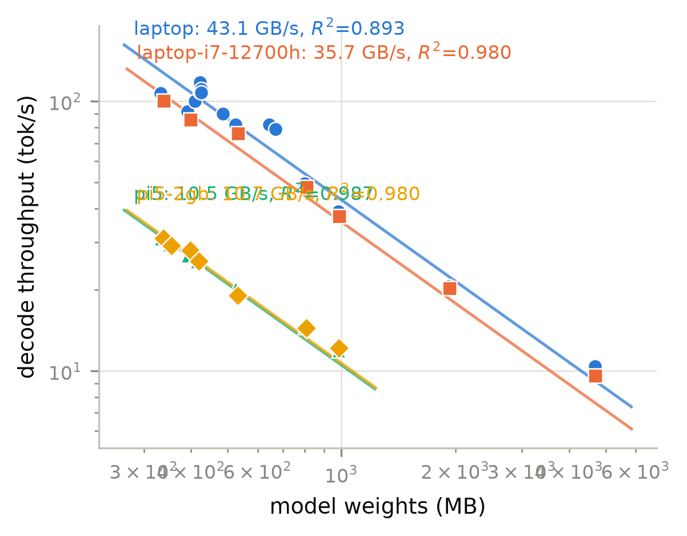
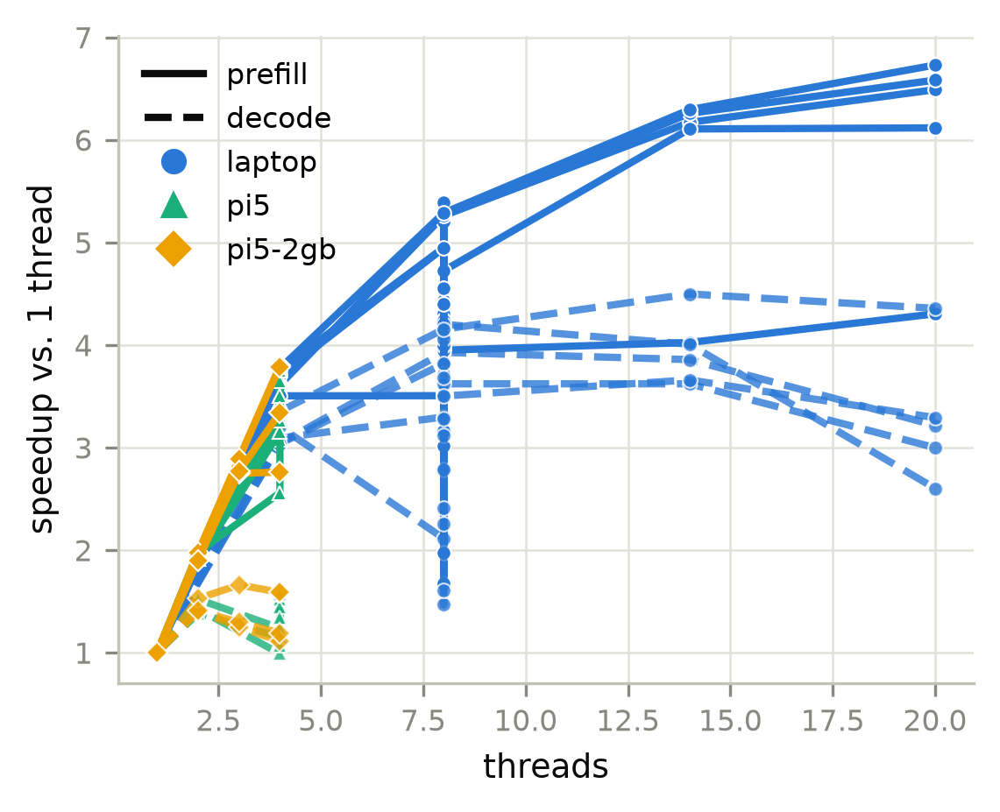
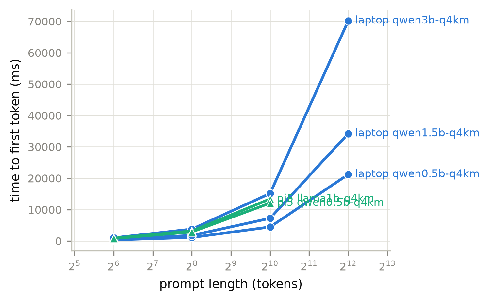
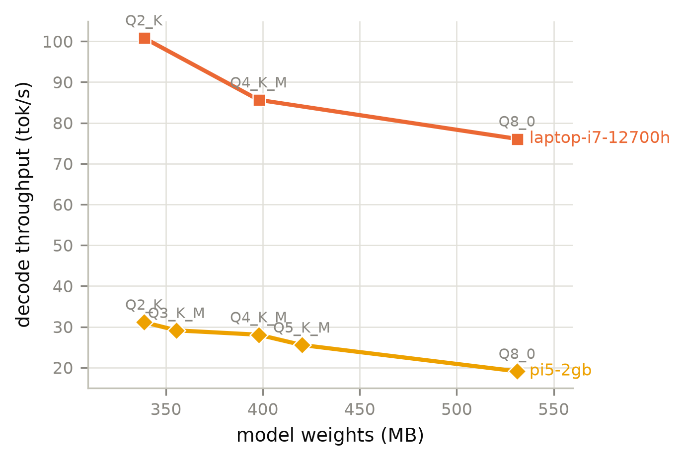
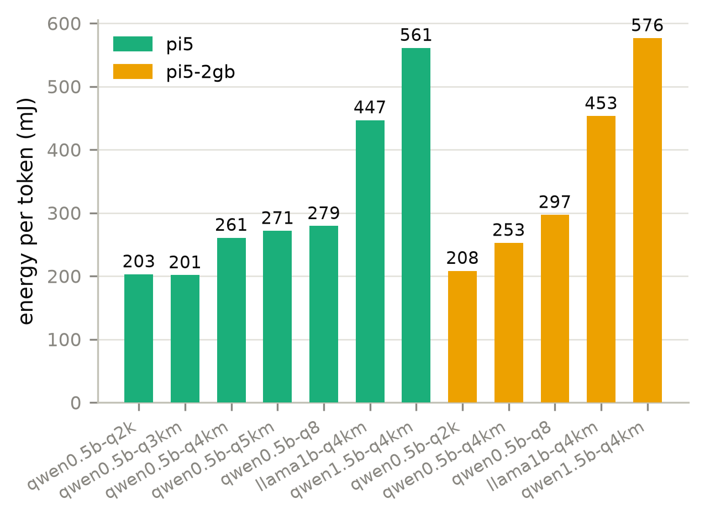
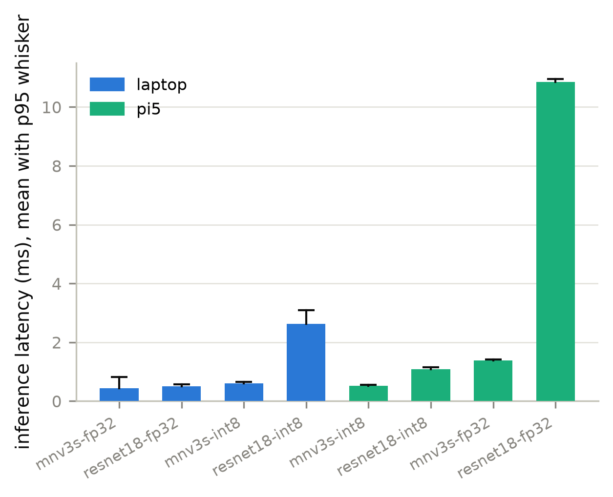

# Benchmark report

> **Integrity notes**
> - 13 run(s) had run-to-run spread above 10%, which usually means the machine was not idle
> - 1 run(s) exceeded the declared memory bandwidth ceiling, so that ceiling is too low rather than the measurement being impossible

## Devices

**Devices under test**

| device | cpu | arch | cores | RAM GB | DRAM peak GB/s | runs |
|---|---|---|---|---|---|---|
| laptop | 12th Gen Intel(R) Core(TM) i7-12700H | AMD64 | 14 | 34.01 | 53.90 | 75 |
| laptop-i7-12700h | 12th Gen Intel(R) Core(TM) i7-12700H | AMD64 | 14 | 34.01 | 42.10 | 7 |
| pi5 | Raspberry Pi 5 Model B Rev 1.0 | aarch64 | 4 | 2.11 | 13.98 | 43 |
| pi5-2gb | Raspberry Pi 5 Model B Rev 1.0 (Cortex-A76) | aarch64 | 4 | 2.11 | 13.98 | 22 |

## Throughput

**LLM decode and prefill throughput**

| device | model | quant | thr | MB | prefill t/s | decode t/s | GB/s | % peak | W | C |
|---|---|---|---|---|---|---|---|---|---|---|
| laptop | qwen0.5b-q2k | Q2_K | 8 | 332.7 | 443.6 | 107.3 | 35.70 | 66.23 | - | - |
| laptop | qwen0.5b-q4km | Q4_K_M | 1 | 391.9 | 55.04 | 21.67 | 8.49 | 15.75 | - | - |
| laptop | qwen0.5b-q4km | Q4_K_M | 4 | 391.9 | 192.8 | 69.39 | 27.19 | 50.45 | - | - |
| laptop | qwen0.5b-q4km | Q4_K_M | 8 | 391.9 | 92.27 | 31.77 | 12.45 | 23.10 | - | - |
| laptop | qwen0.5b-q4km | Q4_K_M | 8 | 391.9 | 166.0 | 60.63 | 23.76 | 44.08 | - | - |
| laptop | qwen0.5b-q4km | Q4_K_M | 8 | 391.9 | 230.8 | 88.47 | 34.67 | 64.32 | - | - |
| laptop | qwen0.5b-q4km | Q4_K_M | 8 | 391.9 | 194.7 | 88.68 | 34.75 | 64.47 | - | - |
| laptop | qwen0.5b-q4km | Q4_K_M | 8 | 391.9 | 218.7 | 91.82 | 35.98 | 66.75 | - | - |
| laptop | qwen0.5b-q4km | Q4_K_M | 8 | 391.9 | 229.5 | 86.64 | 33.95 | 62.99 | - | - |
| laptop | qwen0.5b-q4km | Q4_K_M | 8 | 391.9 | 244.0 | 87.93 | 34.46 | 63.93 | - | - |
| laptop | qwen0.5b-q4km | Q4_K_M | 8 | 391.9 | 237.2 | 90.21 | 35.35 | 65.58 | - | - |
| laptop | qwen0.5b-q4km | Q4_K_M | 8 | 391.9 | 209.7 | 77.49 | 30.36 | 56.34 | - | - |
| laptop | qwen0.5b-q4km | Q4_K_M | 8 | 391.9 | 233.5 | 78.21 | 30.65 | 56.86 | - | - |
| laptop | qwen0.5b-q4km | Q4_K_M | 8 | 391.9 | 217.3 | 91.02 | 35.67 | 66.17 | - | - |
| laptop | qwen0.5b-q4km | Q4_K_M | 14 | 391.9 | 221.5 | 86.83 | 34.02 | 63.12 | - | - |
| laptop | qwen0.5b-q4km | Q4_K_M | 20 | 391.9 | 236.9 | 56.38 | 22.09 | 40.99 | - | - |
| laptop | fp16src-q2k | Q2_K | 8 | 409.2 | 414.8 | 100.3 | 41.05 | 76.15 | - | - |
| laptop | fp16src-iq4xs | IQ4_XS | 8 | 422.1 | 422.4 | 108.3 | 45.71 | 84.81 | - | - |
| laptop | fp16src-q40 | Q4_0 | 8 | 422.8 | 585.2 | 117.6 | 49.71 | 92.23 | - | - |
| laptop | fp16src-iq4nl | IQ4_NL | 8 | 424.9 | 536.1 | 110.8 | 47.06 | 87.32 | - | - |
| laptop | fp16src-q3km | Q3_K_M | 8 | 426.1 | 505.1 | 107.8 | 45.92 | 85.20 | - | - |
| laptop | fp16src-q4km | Q4_K_M | 8 | 485.5 | 242.8 | 90.14 | 43.76 | 81.18 | - | - |
| laptop | qwen0.5b-q8 | Q8_0 | 8 | 525.1 | 233.7 | 82.12 | 43.12 | 80.01 | - | - |
| laptop | fp16src-q6k | Q6_K | 8 | 644.4 | 282.9 | 81.99 | 52.84 | 98.03 | - | - |
| laptop | fp16src-q80 | Q8_0 | 8 | 669.8 | 277.1 | 78.79 | 52.77 | 97.90 | - | - |
| laptop | llama1b-q4km | Q4_K_M | 1 | 799.9 | 36.87 | 12.66 | 10.13 | 18.79 | - | - |
| laptop | llama1b-q4km | Q4_K_M | 4 | 799.9 | 133.2 | 38.52 | 30.81 | 57.16 | - | - |
| laptop | llama1b-q4km | Q4_K_M | 8 | 799.9 | 194.0 | 49.72 | 39.77 | 73.78 | - | - |
| laptop | llama1b-q4km | Q4_K_M | 14 | 799.9 | 227.5 | 48.83 | 39.06 | 72.46 | - | - |
| laptop | llama1b-q4km | Q4_K_M | 20 | 799.9 | 239.3 | 40.71 | 32.56 | 60.41 | - | - |
| laptop | qwen1.5b-q4km | Q4_K_M | 1 | 980.1 | 27.16 | 10.70 | 10.49 | 19.46 | - | - |
| laptop | qwen1.5b-q4km | Q4_K_M | 4 | 980.1 | 100.7 | 33.08 | 32.42 | 60.16 | - | - |
| laptop | qwen1.5b-q4km | Q4_K_M | 8 | 980.1 | 134.3 | 35.28 | 34.58 | 64.15 | - | - |
| laptop | qwen1.5b-q4km | Q4_K_M | 8 | 980.1 | 141.5 | 39.13 | 38.35 | 71.15 | - | - |
| laptop | qwen1.5b-q4km | Q4_K_M | 8 | 980.1 | 53.72 | 17.17 | 16.83 | 31.22 | - | - |
| laptop | qwen1.5b-q4km | Q4_K_M | 8 | 980.1 | 100.8 | 29.78 | 29.19 | 54.15 | - | - |
| laptop | qwen1.5b-q4km | Q4_K_M | 14 | 980.1 | 165.8 | 38.74 | 37.97 | 70.45 | - | - |
| laptop | qwen1.5b-q4km | Q4_K_M | 20 | 980.1 | 166.1 | 32.08 | 31.44 | 58.33 | - | - |
| laptop | qwen3b-q4km | Q4_K_M | 1 | 1,924 | 12.81 | 5.60 | 10.77 | 19.99 | - | - |
| laptop | qwen3b-q4km | Q4_K_M | 4 | 1,924 | 48.16 | 17.01 | 32.72 | 60.71 | - | - |
| laptop | qwen3b-q4km | Q4_K_M | 8 | 1,924 | 69.01 | 20.62 | 39.67 | 73.59 | - | - |
| laptop | qwen3b-q4km | Q4_K_M | 14 | 1,924 | 80.16 | 20.49 | 39.43 | 73.15 | - | - |
| laptop | qwen3b-q4km | Q4_K_M | 20 | 1,924 | 84.33 | 18.43 | 35.46 | 65.79 | - | - |
| laptop | qwen7b-q4km | Q4_K_M | 1 | 4,677 | 5.56 | 2.31 | 10.81 | 20.06 | - | - |
| laptop | qwen7b-q4km | Q4_K_M | 4 | 4,677 | 20.98 | 7.75 | 36.26 | 67.26 | - | - |
| laptop | qwen7b-q4km | Q4_K_M | 8 | 4,677 | 29.42 | 9.60 | 44.90 | 83.30 | - | - |
| laptop | qwen7b-q4km | Q4_K_M | 14 | 4,677 | 35.02 | 10.40 | 48.62 | 90.21 | - | - |
| laptop | qwen7b-q4km | Q4_K_M | 20 | 4,677 | 37.45 | 10.07 | 47.10 | 87.38 | - | - |
| laptop-i7-12700h | qwen0.5b-q2k | Q2_K | 8 | 338.6 | 426.9 | 100.9 | 34.15 | 81.12 | - | - |
| laptop-i7-12700h | qwen0.5b-q4km | Q4_K_M | 8 | 397.8 | 235.8 | 85.64 | 34.07 | 80.93 | - | - |
| laptop-i7-12700h | qwen0.5b-q8 | Q8_0 | 8 | 531.1 | 291.6 | 76.08 | 40.40 | 95.97 | - | - |
| laptop-i7-12700h | llama1b-q4km | Q4_K_M | 14 | 807.7 | 244.8 | 48.13 | 38.87 | 92.33 | - | - |
| laptop-i7-12700h | qwen1.5b-q4km | Q4_K_M | 14 | 986.0 | 162.7 | 37.65 | 37.13 | 88.18 | - | - |
| laptop-i7-12700h | qwen3b-q4km | Q4_K_M | 14 | 1,930 | 84.53 | 20.35 | 39.27 | 93.29 | - | - |
| laptop-i7-12700h | qwen7b-q4km | Q4_K_M | 14 | 4,683 | 36.53 | 9.62 | 45.04 | 107.0 | - | - |
| pi5 | qwen0.5b-q2k | Q2_K | 4 | 332.7 | 150.1 | 30.21 | 10.05 | 71.89 | 6.13 | 57.30 |
| pi5 | qwen0.5b-q2k | Q2_K | 4 | 332.7 | 151.9 | 31.02 | 10.32 | 73.80 | - | 59.50 |
| pi5 | qwen0.5b-q3km | Q3_K_M | 4 | 349.5 | 203.6 | 29.38 | 10.27 | 73.44 | - | 59.50 |
| pi5 | qwen0.5b-q3km | Q3_K_M | 4 | 349.5 | 204.3 | 28.78 | 10.06 | 71.95 | 5.80 | 58.40 |
| pi5 | qwen0.5b-q4km | Q4_K_M | 1 | 391.9 | 24.18 | 16.92 | 6.63 | 47.42 | - | 54.55 |
| pi5 | qwen0.5b-q4km | Q4_K_M | 2 | 391.9 | 47.89 | 25.72 | 10.08 | 72.10 | - | 57.30 |
| pi5 | qwen0.5b-q4km | Q4_K_M | 4 | 391.9 | 61.86 | 20.95 | 8.21 | 58.71 | - | 66.65 |
| pi5 | qwen0.5b-q4km | Q4_K_M | 4 | 391.9 | 81.88 | 24.55 | 9.62 | 68.82 | - | 64.45 |
| pi5 | qwen0.5b-q4km | Q4_K_M | 4 | 391.9 | 89.06 | 26.73 | 10.48 | 74.93 | - | 65.55 |
| pi5 | qwen0.5b-q4km | Q4_K_M | 4 | 391.9 | 91.10 | 26.08 | 10.22 | 73.11 | 6.80 | 61.70 |
| pi5 | qwen0.5b-q4km | Q4_K_M | 4 | 391.9 | 79.90 | 26.74 | 10.48 | 74.97 | - | 68.85 |
| pi5 | qwen0.5b-q4km | Q4_K_M | 4 | 391.9 | 90.67 | 26.51 | 10.39 | 74.31 | - | 63.35 |
| pi5 | qwen0.5b-q4km | Q4_K_M | 4 | 391.9 | 91.58 | 26.73 | 10.47 | 74.92 | - | 60.60 |
| pi5 | qwen0.5b-q4km | Q4_K_M | 4 | 391.9 | 91.68 | 26.83 | 10.51 | 75.20 | - | 64.45 |
| pi5 | qwen0.5b-q4km | Q4_K_M | 4 | 391.9 | 90.74 | 26.60 | 10.42 | 74.55 | - | 60.60 |
| pi5 | qwen0.5b-q5km | Q5_K_M | 4 | 414.1 | 80.83 | 25.05 | 10.38 | 74.21 | 6.80 | 62.25 |
| pi5 | qwen0.5b-q5km | Q5_K_M | 4 | 414.1 | 81.32 | 25.51 | 10.56 | 75.57 | - | 61.70 |
| pi5 | qwen0.5b-q8 | Q8_0 | 4 | 525.1 | 260.3 | 20.33 | 10.68 | 76.38 | - | 59.50 |
| pi5 | qwen0.5b-q8 | Q8_0 | 4 | 525.1 | 256.8 | 19.52 | 10.25 | 73.32 | 5.45 | 60.60 |
| pi5 | llama1b-q4km | Q4_K_M | 1 | 799.9 | 23.15 | 10.21 | 8.17 | 58.41 | - | 54.55 |
| pi5 | llama1b-q4km | Q4_K_M | 2 | 799.9 | 44.31 | 14.55 | 11.64 | 83.26 | - | 57.30 |
| pi5 | llama1b-q4km | Q4_K_M | 4 | 799.9 | 75.54 | 12.25 | 9.80 | 70.10 | 5.47 | 60.60 |
| pi5 | llama1b-q4km | Q4_K_M | 4 | 799.9 | 77.21 | 12.40 | 9.92 | 70.95 | - | 59.50 |
| pi5 | qwen1.5b-q4km | Q4_K_M | 1 | 980.1 | 16.84 | 8.63 | 8.46 | 60.48 | - | 55.65 |
| pi5 | qwen1.5b-q4km | Q4_K_M | 2 | 980.1 | 32.18 | 11.93 | 11.69 | 83.64 | - | 58.95 |
| pi5 | qwen1.5b-q4km | Q4_K_M | 4 | 980.1 | 53.07 | 9.93 | 9.73 | 69.62 | - | 60.05 |
| pi5 | qwen1.5b-q4km | Q4_K_M | 4 | 980.1 | 54.91 | 9.22 | 9.04 | 64.64 | 5.17 | 61.15 |
| pi5-2gb | qwen0.5b-q2k | Q2_K | 4 | 338.6 | - | 29.08 | 9.85 | 70.43 | 6.06 | - |
| pi5-2gb | qwen0.5b-q2k | Q2_K | 4 | 338.6 | 147.7 | 31.13 | 10.54 | 75.40 | - | - |
| pi5-2gb | qwen0.5b-q3km | Q3_K_M | 4 | 355.5 | 197.2 | 29.12 | 10.35 | 74.04 | - | - |
| pi5-2gb | qwen0.5b-q4km | Q4_K_M | 1 | 397.8 | 23.50 | 16.90 | 6.72 | 48.09 | - | - |
| pi5-2gb | qwen0.5b-q4km | Q4_K_M | 2 | 397.8 | 46.50 | 25.81 | 10.27 | 73.44 | - | - |
| pi5-2gb | qwen0.5b-q4km | Q4_K_M | 3 | 397.8 | 67.96 | 28.05 | 11.16 | 79.83 | - | - |
| pi5-2gb | qwen0.5b-q4km | Q4_K_M | 4 | 397.8 | 89.27 | 26.84 | 10.68 | 76.38 | - | - |
| pi5-2gb | qwen0.5b-q4km | Q4_K_M | 4 | 397.8 | 89.04 | 26.84 | 10.68 | 76.37 | - | - |
| pi5-2gb | qwen0.5b-q4km | Q4_K_M | 4 | 397.8 | - | 26.36 | 10.49 | 75.00 | 6.66 | - |
| pi5-2gb | qwen0.5b-q5km | Q5_K_M | 4 | 420.1 | 79.47 | 25.54 | 10.73 | 76.73 | - | - |
| pi5-2gb | qwen0.5b-q8 | Q8_0 | 4 | 531.1 | - | 18.92 | 10.05 | 71.87 | 5.61 | - |
| pi5-2gb | qwen0.5b-q8 | Q8_0 | 4 | 531.1 | 249.3 | 19.09 | 10.14 | 72.50 | - | - |
| pi5-2gb | llama1b-q4km | Q4_K_M | 1 | 807.7 | 22.35 | 10.25 | 8.28 | 59.24 | - | - |
| pi5-2gb | llama1b-q4km | Q4_K_M | 2 | 807.7 | 43.50 | 14.41 | 11.64 | 83.26 | - | - |
| pi5-2gb | llama1b-q4km | Q4_K_M | 3 | 807.7 | 61.41 | 12.82 | 10.35 | 74.06 | - | - |
| pi5-2gb | llama1b-q4km | Q4_K_M | 4 | 807.7 | 61.69 | 11.40 | 9.21 | 65.88 | - | - |
| pi5-2gb | llama1b-q4km | Q4_K_M | 4 | 807.7 | - | 11.28 | 9.11 | 65.16 | 5.11 | - |
| pi5-2gb | qwen1.5b-q4km | Q4_K_M | 1 | 986.0 | 16.55 | 8.67 | 8.55 | 61.16 | - | - |
| pi5-2gb | qwen1.5b-q4km | Q4_K_M | 2 | 986.0 | 31.44 | 12.20 | 12.03 | 86.03 | - | - |
| pi5-2gb | qwen1.5b-q4km | Q4_K_M | 3 | 986.0 | 45.78 | 11.24 | 11.08 | 79.25 | - | - |
| pi5-2gb | qwen1.5b-q4km | Q4_K_M | 4 | 986.0 | 55.27 | 10.34 | 10.19 | 72.91 | - | - |
| pi5-2gb | qwen1.5b-q4km | Q4_K_M | 4 | 986.0 | - | 9.10 | 8.97 | 64.20 | 5.25 | - |

## Decode roofline

**Decode roofline: tokens per second against inverse model size**

| device | points | effective GB/s | R^2 | DRAM peak GB/s | % of peak |
|---|---|---|---|---|---|
| laptop | 15 | 43.11 | 0.89 | 53.90 | 79.99 |
| laptop-i7-12700h | 7 | 35.73 | 0.98 | 42.10 | 84.86 |
| pi5 | 7 | 10.52 | 0.99 | 13.98 | 75.22 |
| pi5-2gb | 7 | 10.69 | 0.98 | 13.98 | 76.48 |

## Thread scaling

**Thread scaling, relative to the lowest thread count measured**

| device | model | threads | prefill t/s | decode t/s | prefill speedup | decode speedup |
|---|---|---|---|---|---|---|
| laptop | llama1b-q4km | 1 | 36.87 | 12.66 | 1.00 | 1.00 |
| laptop | llama1b-q4km | 4 | 133.2 | 38.52 | 3.61 | 3.04 |
| laptop | llama1b-q4km | 8 | 194.0 | 49.72 | 5.26 | 3.93 |
| laptop | llama1b-q4km | 14 | 227.5 | 48.83 | 6.17 | 3.86 |
| laptop | llama1b-q4km | 20 | 239.3 | 40.71 | 6.49 | 3.22 |
| laptop | qwen0.5b-q4km | 1 | 55.04 | 21.67 | 1.00 | 1.00 |
| laptop | qwen0.5b-q4km | 4 | 192.8 | 69.39 | 3.50 | 3.20 |
| laptop | qwen0.5b-q4km | 8 | 192.9 | 45.80 | 3.51 | 2.11 |
| laptop | qwen0.5b-q4km | 8 | 174.6 | 86.39 | 3.17 | 3.99 |
| laptop | qwen0.5b-q4km | 8 | 92.27 | 31.77 | 1.68 | 1.47 |
| laptop | qwen0.5b-q4km | 8 | 225.0 | 79.98 | 4.09 | 3.69 |
| laptop | qwen0.5b-q4km | 8 | 166.0 | 60.63 | 3.02 | 2.80 |
| laptop | qwen0.5b-q4km | 8 | 230.8 | 88.47 | 4.19 | 4.08 |
| laptop | qwen0.5b-q4km | 8 | 194.7 | 88.68 | 3.54 | 4.09 |
| laptop | qwen0.5b-q4km | 8 | 218.7 | 91.82 | 3.97 | 4.24 |
| laptop | qwen0.5b-q4km | 8 | 229.5 | 86.64 | 4.17 | 4.00 |
| laptop | qwen0.5b-q4km | 8 | 228.6 | 68.55 | 4.15 | 3.16 |
| laptop | qwen0.5b-q4km | 8 | 244.0 | 87.93 | 4.43 | 4.06 |
| laptop | qwen0.5b-q4km | 8 | 237.2 | 90.21 | 4.31 | 4.16 |
| laptop | qwen0.5b-q4km | 8 | 209.7 | 77.49 | 3.81 | 3.58 |
| laptop | qwen0.5b-q4km | 8 | 233.5 | 78.21 | 4.24 | 3.61 |
| laptop | qwen0.5b-q4km | 8 | 217.3 | 91.02 | 3.95 | 4.20 |
| laptop | qwen0.5b-q4km | 14 | 221.5 | 86.83 | 4.02 | 4.01 |
| laptop | qwen0.5b-q4km | 20 | 236.9 | 56.38 | 4.30 | 2.60 |
| laptop | qwen1.5b-q4km | 1 | 27.16 | 10.70 | 1.00 | 1.00 |
| laptop | qwen1.5b-q4km | 4 | 100.7 | 33.08 | 3.71 | 3.09 |
| laptop | qwen1.5b-q4km | 8 | 134.3 | 35.28 | 4.95 | 3.30 |
| laptop | qwen1.5b-q4km | 8 | 141.5 | 39.13 | 5.21 | 3.66 |
| laptop | qwen1.5b-q4km | 8 | 143.2 | 37.59 | 5.27 | 3.51 |
| laptop | qwen1.5b-q4km | 8 | 119.6 | 24.09 | 4.40 | 2.25 |
| laptop | qwen1.5b-q4km | 8 | 141.2 | 33.33 | 5.20 | 3.12 |
| laptop | qwen1.5b-q4km | 8 | 53.72 | 17.17 | 1.98 | 1.60 |
| laptop | qwen1.5b-q4km | 8 | 100.8 | 29.78 | 3.71 | 2.78 |
| laptop | qwen1.5b-q4km | 8 | 128.3 | 38.74 | 4.72 | 3.62 |
| laptop | qwen1.5b-q4km | 14 | 165.8 | 38.74 | 6.11 | 3.62 |
| laptop | qwen1.5b-q4km | 20 | 166.1 | 32.08 | 6.12 | 3.00 |
| laptop | qwen3b-q4km | 1 | 12.81 | 5.60 | 1.00 | 1.00 |
| laptop | qwen3b-q4km | 4 | 48.16 | 17.01 | 3.76 | 3.04 |
| laptop | qwen3b-q4km | 8 | 63.40 | 21.38 | 4.95 | 3.82 |
| laptop | qwen3b-q4km | 8 | 67.57 | 18.38 | 5.27 | 3.28 |
| laptop | qwen3b-q4km | 8 | 69.01 | 20.62 | 5.39 | 3.68 |
| laptop | qwen3b-q4km | 8 | 58.35 | 13.48 | 4.55 | 2.41 |
| laptop | qwen3b-q4km | 8 | 67.43 | 19.61 | 5.26 | 3.50 |
| laptop | qwen3b-q4km | 14 | 80.16 | 20.49 | 6.26 | 3.66 |
| laptop | qwen3b-q4km | 20 | 84.33 | 18.43 | 6.58 | 3.29 |
| laptop | qwen7b-q4km | 1 | 5.56 | 2.31 | 1.00 | 1.00 |
| laptop | qwen7b-q4km | 4 | 20.98 | 7.75 | 3.77 | 3.35 |
| laptop | qwen7b-q4km | 8 | 29.42 | 9.60 | 5.29 | 4.15 |
| laptop | qwen7b-q4km | 14 | 35.02 | 10.40 | 6.29 | 4.50 |
| laptop | qwen7b-q4km | 20 | 37.45 | 10.07 | 6.73 | 4.36 |
| pi5 | llama1b-q4km | 1 | 23.15 | 10.21 | 1.00 | 1.00 |
| pi5 | llama1b-q4km | 2 | 44.31 | 14.55 | 1.91 | 1.43 |
| pi5 | llama1b-q4km | 4 | 76.45 | 10.11 | 3.30 | 0.99 |
| pi5 | llama1b-q4km | 4 | 71.19 | 12.08 | 3.08 | 1.18 |
| pi5 | llama1b-q4km | 4 | 75.54 | 12.25 | 3.26 | 1.20 |
| pi5 | llama1b-q4km | 4 | 77.21 | 12.40 | 3.34 | 1.21 |
| pi5 | llama1b-q4km | 4 | 79.91 | 11.41 | 3.45 | 1.12 |
| pi5 | qwen0.5b-q2k | 4 | 150.1 | 30.21 | 1.00 | 1.00 |
| pi5 | qwen0.5b-q2k | 4 | 151.9 | 31.02 | 1.01 | 1.03 |
| pi5 | qwen0.5b-q3km | 4 | 203.6 | 29.38 | 1.00 | 1.00 |
| pi5 | qwen0.5b-q3km | 4 | 204.3 | 28.78 | 1.00 | 0.98 |
| pi5 | qwen0.5b-q4km | 1 | 24.18 | 16.92 | 1.00 | 1.00 |
| pi5 | qwen0.5b-q4km | 2 | 47.89 | 25.72 | 1.98 | 1.52 |
| pi5 | qwen0.5b-q4km | 4 | 61.86 | 20.95 | 2.56 | 1.24 |
| pi5 | qwen0.5b-q4km | 4 | 81.88 | 24.55 | 3.39 | 1.45 |
| pi5 | qwen0.5b-q4km | 4 | 89.06 | 26.73 | 3.68 | 1.58 |
| pi5 | qwen0.5b-q4km | 4 | 91.10 | 26.08 | 3.77 | 1.54 |
| pi5 | qwen0.5b-q4km | 4 | 79.90 | 26.74 | 3.30 | 1.58 |
| pi5 | qwen0.5b-q4km | 4 | 81.09 | 25.77 | 3.35 | 1.52 |
| pi5 | qwen0.5b-q4km | 4 | 88.23 | 24.39 | 3.65 | 1.44 |
| pi5 | qwen0.5b-q4km | 4 | 90.67 | 26.51 | 3.75 | 1.57 |
| pi5 | qwen0.5b-q4km | 4 | 91.58 | 26.73 | 3.79 | 1.58 |
| pi5 | qwen0.5b-q4km | 4 | 84.73 | 22.65 | 3.50 | 1.34 |
| pi5 | qwen0.5b-q4km | 4 | 91.68 | 26.83 | 3.79 | 1.59 |
| pi5 | qwen0.5b-q4km | 4 | 90.74 | 26.60 | 3.75 | 1.57 |
| pi5 | qwen0.5b-q5km | 4 | 80.83 | 25.05 | 1.00 | 1.00 |
| pi5 | qwen0.5b-q5km | 4 | 81.32 | 25.51 | 1.01 | 1.02 |
| pi5 | qwen0.5b-q8 | 4 | 260.3 | 20.33 | 1.00 | 1.00 |
| pi5 | qwen0.5b-q8 | 4 | 256.8 | 19.52 | 0.99 | 0.96 |
| pi5 | qwen1.5b-q4km | 1 | 16.84 | 8.63 | 1.00 | 1.00 |
| pi5 | qwen1.5b-q4km | 2 | 32.18 | 11.93 | 1.91 | 1.38 |
| pi5 | qwen1.5b-q4km | 4 | 53.07 | 9.93 | 3.15 | 1.15 |
| pi5 | qwen1.5b-q4km | 4 | 54.91 | 9.22 | 3.26 | 1.07 |
| pi5-2gb | llama1b-q4km | 1 | 22.35 | 10.25 | 1.00 | 1.00 |
| pi5-2gb | llama1b-q4km | 2 | 43.50 | 14.41 | 1.95 | 1.41 |
| pi5-2gb | llama1b-q4km | 3 | 61.41 | 12.82 | 2.75 | 1.25 |
| pi5-2gb | llama1b-q4km | 4 | 61.69 | 11.40 | 2.76 | 1.11 |
| pi5-2gb | llama1b-q4km | 4 | - | 11.28 | - | 1.10 |
| pi5-2gb | qwen0.5b-q2k | 4 | - | 29.08 | - | 1.00 |
| pi5-2gb | qwen0.5b-q2k | 4 | 147.7 | 31.13 | - | 1.07 |
| pi5-2gb | qwen0.5b-q4km | 1 | 23.50 | 16.90 | 1.00 | 1.00 |
| pi5-2gb | qwen0.5b-q4km | 2 | 46.50 | 25.81 | 1.98 | 1.53 |
| pi5-2gb | qwen0.5b-q4km | 3 | 67.96 | 28.05 | 2.89 | 1.66 |
| pi5-2gb | qwen0.5b-q4km | 4 | 89.27 | 26.84 | 3.80 | 1.59 |
| pi5-2gb | qwen0.5b-q4km | 4 | 89.04 | 26.84 | 3.79 | 1.59 |
| pi5-2gb | qwen0.5b-q4km | 4 | - | 26.36 | - | 1.56 |
| pi5-2gb | qwen0.5b-q8 | 4 | - | 18.92 | - | 1.00 |
| pi5-2gb | qwen0.5b-q8 | 4 | 249.3 | 19.09 | - | 1.01 |
| pi5-2gb | qwen1.5b-q4km | 1 | 16.55 | 8.67 | 1.00 | 1.00 |
| pi5-2gb | qwen1.5b-q4km | 2 | 31.44 | 12.20 | 1.90 | 1.41 |
| pi5-2gb | qwen1.5b-q4km | 3 | 45.78 | 11.24 | 2.77 | 1.30 |
| pi5-2gb | qwen1.5b-q4km | 4 | 55.27 | 10.34 | 3.34 | 1.19 |
| pi5-2gb | qwen1.5b-q4km | 4 | - | 9.10 | - | 1.05 |

## Quantisation

**Quantisation frontier**

| device | model | quant | MB | decode t/s | GB/s | mJ/token |
|---|---|---|---|---|---|---|
| laptop | qwen0.5b-q2k | Q2_K | 332.7 | 107.3 | 35.70 | - |
| laptop | qwen0.5b-q4km | Q4_K_M | 391.9 | 91.82 | 35.98 | - |
| laptop | fp16src-q2k | Q2_K | 409.2 | 100.3 | 41.05 | - |
| laptop | fp16src-iq4xs | IQ4_XS | 422.1 | 108.3 | 45.71 | - |
| laptop | fp16src-q40 | Q4_0 | 422.8 | 117.6 | 49.71 | - |
| laptop | fp16src-iq4nl | IQ4_NL | 424.9 | 110.8 | 47.06 | - |
| laptop | fp16src-q3km | Q3_K_M | 426.1 | 107.8 | 45.92 | - |
| laptop | fp16src-q4km | Q4_K_M | 485.5 | 90.14 | 43.76 | - |
| laptop | qwen0.5b-q8 | Q8_0 | 525.1 | 82.12 | 43.12 | - |
| laptop | fp16src-q6k | Q6_K | 644.4 | 81.99 | 52.84 | - |
| laptop | fp16src-q80 | Q8_0 | 669.8 | 78.79 | 52.77 | - |
| laptop | llama1b-q4km | Q4_K_M | 799.9 | 49.72 | 39.77 | - |
| laptop | qwen1.5b-q4km | Q4_K_M | 980.1 | 39.13 | 38.35 | - |
| laptop | qwen3b-q4km | Q4_K_M | 1,924 | 20.62 | 39.67 | - |
| laptop | qwen7b-q4km | Q4_K_M | 4,677 | 10.40 | 48.62 | - |
| laptop-i7-12700h | qwen0.5b-q2k | Q2_K | 338.6 | 100.9 | 34.15 | - |
| laptop-i7-12700h | qwen0.5b-q4km | Q4_K_M | 397.8 | 85.64 | 34.07 | - |
| laptop-i7-12700h | qwen0.5b-q8 | Q8_0 | 531.1 | 76.08 | 40.40 | - |
| laptop-i7-12700h | llama1b-q4km | Q4_K_M | 807.7 | 48.13 | 38.87 | - |
| laptop-i7-12700h | qwen1.5b-q4km | Q4_K_M | 986.0 | 37.65 | 37.13 | - |
| laptop-i7-12700h | qwen3b-q4km | Q4_K_M | 1,930 | 20.35 | 39.27 | - |
| laptop-i7-12700h | qwen7b-q4km | Q4_K_M | 4,683 | 9.62 | 45.04 | - |
| pi5 | qwen0.5b-q2k | Q2_K | 332.7 | 31.02 | 10.32 | - |
| pi5 | qwen0.5b-q3km | Q3_K_M | 349.5 | 29.38 | 10.27 | - |
| pi5 | qwen0.5b-q4km | Q4_K_M | 391.9 | 26.83 | 10.51 | - |
| pi5 | qwen0.5b-q5km | Q5_K_M | 414.1 | 25.51 | 10.56 | - |
| pi5 | qwen0.5b-q8 | Q8_0 | 525.1 | 20.33 | 10.68 | - |
| pi5 | llama1b-q4km | Q4_K_M | 799.9 | 14.55 | 11.64 | - |
| pi5 | qwen1.5b-q4km | Q4_K_M | 980.1 | 11.93 | 11.69 | - |
| pi5-2gb | qwen0.5b-q2k | Q2_K | 338.6 | 31.13 | 10.54 | - |
| pi5-2gb | qwen0.5b-q3km | Q3_K_M | 355.5 | 29.12 | 10.35 | - |
| pi5-2gb | qwen0.5b-q4km | Q4_K_M | 397.8 | 28.05 | 11.16 | - |
| pi5-2gb | qwen0.5b-q5km | Q5_K_M | 420.1 | 25.54 | 10.73 | - |
| pi5-2gb | qwen0.5b-q8 | Q8_0 | 531.1 | 19.09 | 10.14 | - |
| pi5-2gb | llama1b-q4km | Q4_K_M | 807.7 | 14.41 | 11.64 | - |
| pi5-2gb | qwen1.5b-q4km | Q4_K_M | 986.0 | 12.20 | 12.03 | - |

## Latency

**Single-request latency**

| device | model | prompt tok | output tok | TTFT ms | e2e ms | decode t/s | implied prefill t/s |
|---|---|---|---|---|---|---|---|
| laptop | qwen0.5b-q4km | 64 | 64 | 366.6 | 1,096 | 86.39 | 174.6 |
| laptop | qwen0.5b-q4km | 256 | 64 | 1,138 | 1,926 | 79.98 | 225.0 |
| laptop | qwen0.5b-q4km | 1024 | 64 | 4,479 | 5,392 | 68.55 | 228.6 |
| laptop | qwen0.5b-q4km | 4096 | 64 | 21,230 | 22,662 | 45.80 | 192.9 |
| laptop | qwen1.5b-q4km | 64 | 64 | 498.8 | 2,117 | 38.74 | 128.3 |
| laptop | qwen1.5b-q4km | 256 | 64 | 1,787 | 3,468 | 37.59 | 143.2 |
| laptop | qwen1.5b-q4km | 1024 | 64 | 7,251 | 9,159 | 33.33 | 141.2 |
| laptop | qwen1.5b-q4km | 4096 | 64 | 34,248 | 36,882 | 24.09 | 119.6 |
| laptop | qwen3b-q4km | 64 | 64 | 1,010 | 3,960 | 21.38 | 63.40 |
| laptop | qwen3b-q4km | 256 | 64 | 3,796 | 6,971 | 19.61 | 67.43 |
| laptop | qwen3b-q4km | 1024 | 64 | 15,155 | 18,550 | 18.38 | 67.57 |
| laptop | qwen3b-q4km | 4096 | 64 | 70,200 | 74,873 | 13.48 | 58.35 |
| pi5 | llama1b-q4km | 64 | 64 | 898.9 | 6,124 | 12.08 | 71.19 |
| pi5 | llama1b-q4km | 256 | 64 | 3,203 | 8,749 | 11.41 | 79.91 |
| pi5 | llama1b-q4km | 1024 | 64 | 13,395 | 19,611 | 10.11 | 76.45 |
| pi5 | qwen0.5b-q4km | 64 | 64 | 789.2 | 3,235 | 25.77 | 81.09 |
| pi5 | qwen0.5b-q4km | 256 | 64 | 2,901 | 5,484 | 24.39 | 88.23 |
| pi5 | qwen0.5b-q4km | 1024 | 64 | 12,086 | 14,906 | 22.65 | 84.73 |

## Energy

**Power and energy**

| device | model | quant | thr | W total | W core | W DRAM | DRAM % | mJ/token | C |
|---|---|---|---|---|---|---|---|---|---|
| pi5 | llama1b-q4km | Q4_K_M | 4 | 5.47 | 3.71 | 0.24 | 4.43 | 446.6 | 60.60 |
| pi5 | qwen0.5b-q2k | Q2_K | 4 | 6.13 | 4.39 | 0.25 | 4.09 | 202.8 | 57.30 |
| pi5 | qwen0.5b-q3km | Q3_K_M | 4 | 5.80 | 4.05 | 0.25 | 4.39 | 201.4 | 58.40 |
| pi5 | qwen0.5b-q4km | Q4_K_M | 4 | 6.80 | 5.07 | 0.24 | 3.49 | 260.6 | 61.70 |
| pi5 | qwen0.5b-q5km | Q5_K_M | 4 | 6.80 | 5.06 | 0.24 | 3.56 | 271.5 | 62.25 |
| pi5 | qwen0.5b-q8 | Q8_0 | 4 | 5.45 | 3.68 | 0.26 | 4.76 | 279.1 | 60.60 |
| pi5 | qwen1.5b-q4km | Q4_K_M | 4 | 5.17 | 3.45 | 0.21 | 4.13 | 561.0 | 61.15 |
| pi5-2gb | llama1b-q4km | Q4_K_M | 4 | 5.11 | 3.43 | 0.20 | 4.00 | 453.1 | - |
| pi5-2gb | qwen0.5b-q2k | Q2_K | 4 | 6.06 | 4.30 | 0.28 | 4.54 | 208.3 | - |
| pi5-2gb | qwen0.5b-q4km | Q4_K_M | 4 | 6.66 | 4.92 | 0.28 | 4.23 | 252.6 | - |
| pi5-2gb | qwen0.5b-q8 | Q8_0 | 4 | 5.61 | 3.87 | 0.29 | 5.13 | 296.7 | - |
| pi5-2gb | qwen1.5b-q4km | Q4_K_M | 4 | 5.25 | 3.55 | 0.21 | 4.01 | 576.4 | - |

## Vision

**ONNX Runtime inference latency**

| device | model | quant | shape | thr | mean ms | p50 | p95 | p99 | inf/s | W |
|---|---|---|---|---|---|---|---|---|---|---|
| laptop | mnv3s-fp32 | fp32 | 1x3x32x32 | 8 | 0.59 | 0.57 | 0.69 | 0.88 | 1,697 | - |
| laptop | mnv3s-fp32 | fp32 | 1x3x32x32 | 4 | 0.47 | 0.46 | 0.56 | 0.62 | 2,129 | - |
| laptop | mnv3s-fp32 | fp32 | 1x3x32x32 | 1 | 0.44 | 0.38 | 0.82 | 0.90 | 2,273 | - |
| laptop | mnv3s-int8 | int8 | 1x3x32x32 | 4 | 0.73 | 0.68 | 0.90 | 1.10 | 1,370 | - |
| laptop | mnv3s-int8 | int8 | 1x3x32x32 | 1 | 0.60 | 0.59 | 0.66 | 0.77 | 1,665 | - |
| laptop | mnv3s-int8 | int8 | 1x3x32x32 | 8 | 0.77 | 0.73 | 0.95 | 1.02 | 1,296 | - |
| laptop | resnet18-fp32 | fp32 | 1x3x32x32 | 8 | 0.50 | 0.50 | 0.58 | 0.63 | 1,983 | - |
| laptop | resnet18-fp32 | fp32 | 1x3x32x32 | 4 | 0.64 | 0.62 | 0.88 | 1.04 | 1,557 | - |
| laptop | resnet18-fp32 | fp32 | 1x3x32x32 | 1 | 1.63 | 1.57 | 2.24 | 3.01 | 613.3 | - |
| laptop | resnet18-int8 | int8 | 1x3x32x32 | 1 | 3.36 | 3.23 | 4.28 | 4.88 | 297.7 | - |
| laptop | resnet18-int8 | int8 | 1x3x32x32 | 8 | 2.63 | 2.54 | 3.09 | 3.62 | 379.4 | - |
| laptop | resnet18-int8 | int8 | 64x3x32x32 | 8 | 43.04 | 42.93 | 45.99 | 46.56 | 1,487 | - |
| laptop | resnet18-int8 | int8 | 16x3x32x32 | 8 | 12.76 | 12.71 | 14.14 | 14.67 | 1,254 | - |
| laptop | resnet18-int8 | int8 | 4x3x32x32 | 8 | 4.90 | 4.94 | 5.54 | 5.71 | 815.8 | - |
| laptop | resnet18-int8 | int8 | 1x3x32x32 | 4 | 2.78 | 2.72 | 3.32 | 3.52 | 358.8 | - |
| pi5 | mnv3s-fp32 | fp32 | 1x3x32x32 | 4 | 1.38 | 1.37 | 1.41 | 1.43 | 724.7 | - |
| pi5 | mnv3s-fp32 | fp32 | 1x3x32x32 | 1 | 1.98 | 1.98 | 2.01 | 2.02 | 504.5 | - |
| pi5 | mnv3s-int8 | int8 | 1x3x32x32 | 4 | 0.52 | 0.52 | 0.55 | 0.55 | 1,902 | - |
| pi5 | mnv3s-int8 | int8 | 1x3x32x32 | 1 | 0.57 | 0.57 | 0.60 | 0.60 | 1,747 | - |
| pi5 | mnv3s-int8 | int8 | 1x3x32x32 | 4 | 0.55 | 0.53 | 0.62 | 0.74 | 1,829 | - |
| pi5 | resnet18-fp32 | fp32 | 1x3x32x32 | 4 | 12.78 | 12.74 | 13.14 | 13.29 | 78.23 | - |
| pi5 | resnet18-fp32 | fp32 | 1x3x32x32 | 1 | 10.86 | 10.85 | 10.95 | 11.03 | 92.05 | - |
| pi5 | resnet18-int8 | int8 | 1x3x32x32 | 4 | 1.10 | 1.09 | 1.14 | 1.16 | 904.7 | - |
| pi5 | resnet18-int8 | int8 | 1x3x32x32 | 1 | 1.30 | 1.29 | 1.32 | 1.34 | 769.3 | - |
| pi5 | resnet18-int8 | int8 | 1x3x32x32 | 4 | 1.09 | 1.07 | 1.16 | 1.37 | 914.5 | - |

## Cross-platform

**Same model, every device: best decode rate**

| model | quant | laptop t/s | laptop-i7-12700h t/s | pi5 t/s | pi5-2gb t/s | ratio |
|---|---|---|---|---|---|---|
| llama1b-q4km | Q4_K_M | 49.72 | 48.13 | 14.55 | 14.41 | 3.45 |
| qwen0.5b-q2k | Q2_K | 107.3 | 100.9 | 31.02 | 31.13 | 3.46 |
| qwen0.5b-q3km | Q3_K_M | - | - | 29.38 | 29.12 | 1.01 |
| qwen0.5b-q4km | Q4_K_M | 91.82 | 85.64 | 26.83 | 28.05 | 3.42 |
| qwen0.5b-q5km | Q5_K_M | - | - | 25.51 | 25.54 | 1.00 |
| qwen0.5b-q8 | Q8_0 | 82.12 | 76.08 | 20.33 | 19.09 | 4.30 |
| qwen1.5b-q4km | Q4_K_M | 39.13 | 37.65 | 11.93 | 12.20 | 3.28 |
| qwen3b-q4km | Q4_K_M | 21.38 | 20.35 | - | - | 1.05 |
| qwen7b-q4km | Q4_K_M | 10.40 | 9.62 | - | - | 1.08 |

## Figures

