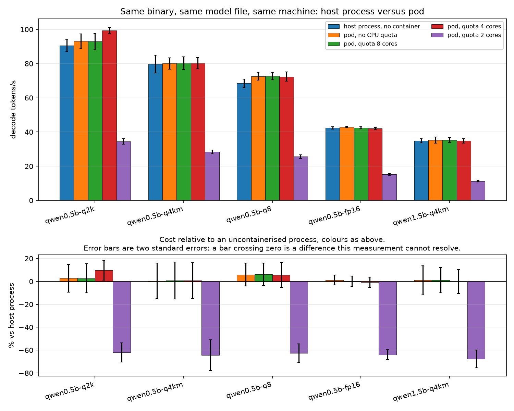

# What containerisation costs an inference benchmark

## The result, in one paragraph

Running the same binary in a Kubernetes pod instead of as a host process changes decode throughput by at most 3.1% on average, slightly faster in the pod, and 14 of 15 individual comparisons cannot be resolved from the run-to-run noise at all. The honest reading is that this measurement cannot find a cost of containerisation, not that it has proved there is none. A CPU quota does not change that, as long as the quota is at least the benchmark's thread count.

A quota *below* the thread count is a different story: at 2 cores against 4 threads, throughput falls 64%, and that difference is resolved on every point. The cost is not the container. It is asking for more parallelism than the cgroup will let you have, which is a configuration anyone can write by accident and which no amount of container tuning will fix.

The ranking of the models is identical in every arm, including the one losing most of its throughput. The tax is close enough to multiplicative that relative comparisons survive it, which is the practical answer for anyone choosing between quantisation formats by benchmarking inside a pod.

Metric: `decode_tps`. Arms, in order of how much sits between the benchmark
and the CPU: wsl-host (quota none), k8s-unlimited (quota none), k8s-cpu8 (quota 8.0), k8s-cpu4 (quota 4.0), k8s-cpu2 (quota 2.0).

50 successful records across 2 independent pass(es) of the matrix.

## Absolute

| model | host process, no container | pod, no CPU quota | pod, quota 8 cores | pod, quota 4 cores | pod, quota 2 cores |
|---|---|---|---|---|---|
| qwen0.5b-q2k | 90.54 ±12.1% | 93.15 ±14.5% | 93.02 ±15.8% | 99.38 ±5.8% | 34.42 ±14.8% |
| qwen0.5b-q4km | 79.76 ±20.8% | 80.07 ±13.1% | 80.30 ±14.7% | 80.32 ±13.0% | 28.43 ±12.4% |
| qwen0.5b-q8 | 68.48 ±11.7% | 72.59 ±10.3% | 72.69 ±9.7% | 72.37 ±11.9% | 25.59 ±13.1% |
| qwen0.5b-fp16 | 42.40 ±5.8% | 42.91 ±3.5% | 42.46 ±4.5% | 42.14 ±4.2% | 15.25 ±10.3% |
| qwen1.5b-q4km | 34.86 ±11.6% | 35.23 ±16.2% | 35.25 ±12.9% | 34.86 ±11.8% | 11.27 ±12.2% |

The `±` is llama-bench's own run-to-run spread within a single point. The
uncertainty in each mean is that over the square root of the repetition count,
and it is the noise floor every claim below has to clear.

## Relative to an uncontainerised process on the same machine

| model | pod, no CPU quota | pod, quota 8 cores | pod, quota 4 cores | pod, quota 2 cores |
|---|---|---|---|---|
| qwen0.5b-q2k | +2.9% (ns) | +2.7% (ns) | +9.8% | -62.0% |
| qwen0.5b-q4km | +0.4% (ns) | +0.7% (ns) | +0.7% (ns) | -64.4% |
| qwen0.5b-q8 | +6.0% (ns) | +6.2% (ns) | +5.7% (ns) | -62.6% |
| qwen0.5b-fp16 | +1.2% (ns) | +0.1% (ns) | -0.6% (ns) | -64.0% |
| qwen1.5b-q4km | +1.1% (ns) | +1.1% (ns) | -0.0% (ns) | -67.7% |

`(ns)` marks a difference this measurement cannot resolve: the two means are
closer together than two standard errors. Resolved points per arm: pod, no CPU quota 0/5, pod, quota 8 cores 0/5, pod, quota 4 cores 1/5, pod, quota 2 cores 5/5.

## Does a quota also change the spread?

| arm | mean run-to-run spread | worst |
|---|---|---|
| host process, no container | 12.4% | 20.8% |
| pod, no CPU quota | 11.5% | 16.2% |
| pod, quota 8 cores | 11.5% | 15.8% |
| pod, quota 4 cores | 9.4% | 13.0% |
| pod, quota 2 cores | 12.5% | 14.8% |

## Does it change the ranking?

| arm | order, fastest first | vs host | Kendall tau |
|---|---|---|---|
| host process, no container | qwen0.5b-q2k > qwen0.5b-q4km > qwen0.5b-q8 > qwen0.5b-fp16 > qwen1.5b-q4km | same | +1.00 |
| pod, no CPU quota | qwen0.5b-q2k > qwen0.5b-q4km > qwen0.5b-q8 > qwen0.5b-fp16 > qwen1.5b-q4km | same | +1.00 |
| pod, quota 8 cores | qwen0.5b-q2k > qwen0.5b-q4km > qwen0.5b-q8 > qwen0.5b-fp16 > qwen1.5b-q4km | same | +1.00 |
| pod, quota 4 cores | qwen0.5b-q2k > qwen0.5b-q4km > qwen0.5b-q8 > qwen0.5b-fp16 > qwen1.5b-q4km | same | +1.00 |
| pod, quota 2 cores | qwen0.5b-q2k > qwen0.5b-q4km > qwen0.5b-q8 > qwen0.5b-fp16 > qwen1.5b-q4km | same | +1.00 |

**No arm reorders the models by more than this measurement can resolve.** Whatever containerisation costs here, it does not change which model wins.

This is a negative result and it is the useful kind: a comparison made inside a pod picks the same winner as the same comparison made outside one, which is the question most people benchmarking in Kubernetes actually need answered.

## Controls

* **One binary.** llama-bench is built once, in `docker/Dockerfile`, and the host's copy is extracted from that same image, so no part of any difference above can be a compiler or a build flag.
* **One image.** Every pod ran `sha256:a426b12530da5779ba1cf5b48aa296ef96e605308767a33a7f3686a65b6ddb3a`, recorded by digest in each run record rather than taken from a tag.
* **One model file.** The pods mount the model directory from the node read-only, so every arm reads the same inode and no overlayfs copy sits in the read path.
* **One at a time.** All arms are one physical CPU wearing several device ids, so they share a scheduler resource group that holds exactly one job and takes turns between arms. Without the turn-taking, one arm ran its entire queue before any other arm started, and each arm would have sat in a different part of the machine's thermal history.
* **Effective limits, not configured ones.** Each record carries the cgroup ceilings read from inside its own container, so the quota in the table is the quota that applied rather than the one the config asked for.
* **Drift.** Two independent passes over the whole matrix. Point by point, the second pass differs from the first by +2.5% on average and by at most 21.4%.

## Limitations, stated rather than discovered

* The host arm is a process on a WSL2 Linux host, which is itself a virtual machine. That layer is present in all arms and cancels out of every comparison here, but these are not bare-metal numbers and must not be described as such.
* One machine, one CPU architecture, one inference engine, one model family. Nothing here says what happens on a server-class chip, on Arm, or under a different runtime.
* Throughput and prefill only. Tail latency under a CFS quota is a different question and a more hostile one, because throttling lands on individual requests rather than on an average.
* Three nodes in a home lab is not a fleet, and nothing here should be read as evidence about fleet-scale behaviour.

## Figure

