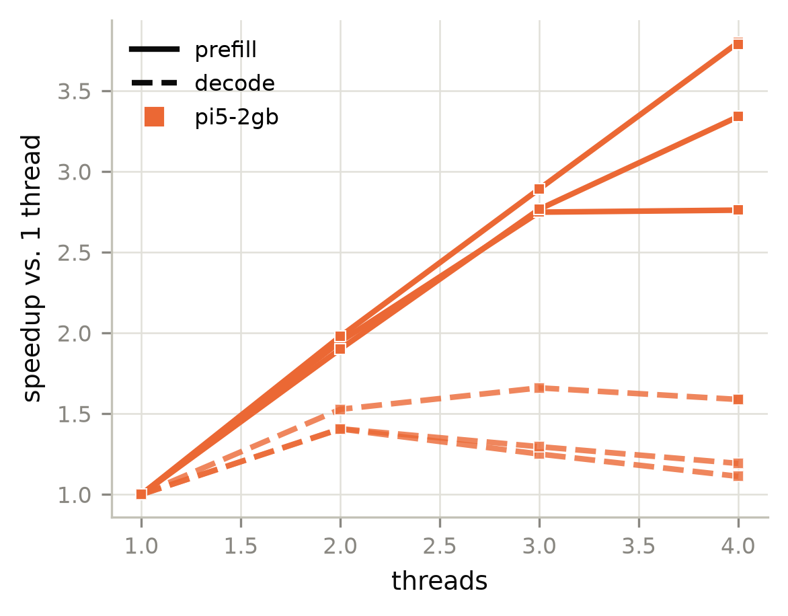
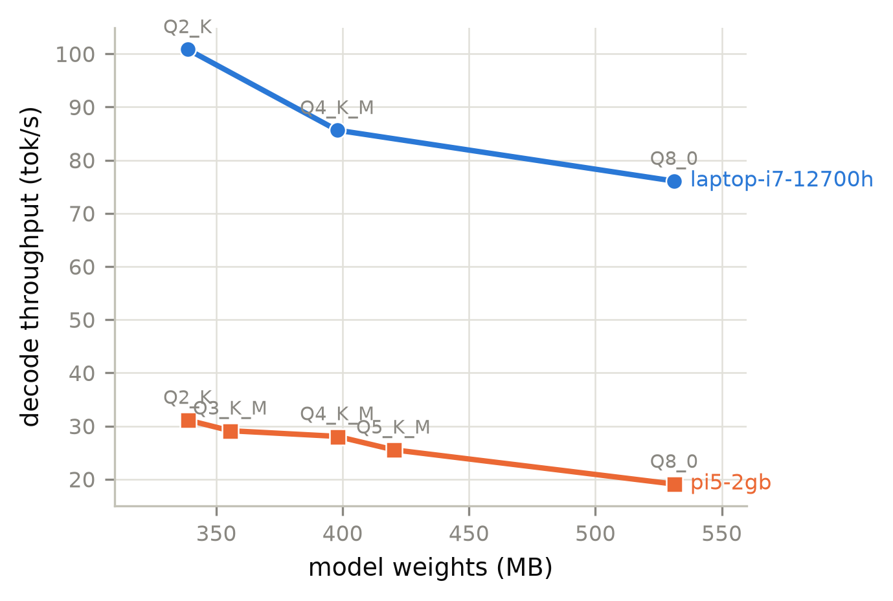
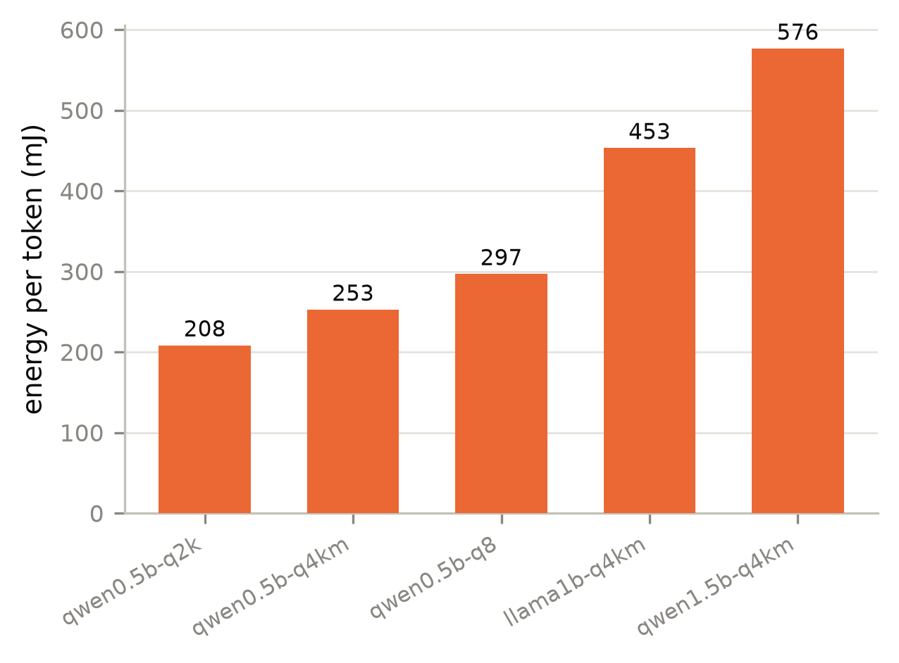

# Benchmark report

> **Integrity notes**
> - 1 run(s) exceeded the declared memory bandwidth ceiling, so that ceiling is too low rather than the measurement being impossible

## Devices

**Devices under test**

| device | cpu | arch | cores | RAM GB | DRAM peak GB/s | runs |
|---|---|---|---|---|---|---|
| laptop-i7-12700h | 12th Gen Intel(R) Core(TM) i7-12700H | AMD64 | 14 | 34.01 | 42.10 | 7 |
| pi5-2gb | Raspberry Pi 5 Model B Rev 1.0 (Cortex-A76) | aarch64 | 4 | 2.11 | 13.98 | 22 |

## Throughput

**LLM decode and prefill throughput**

| device | model | quant | thr | MB | prefill t/s | decode t/s | GB/s | % peak | W | C |
|---|---|---|---|---|---|---|---|---|---|---|
| laptop-i7-12700h | qwen0.5b-q2k | Q2_K | 8 | 338.6 | 426.9 | 100.9 | 34.15 | 81.12 | - | - |
| laptop-i7-12700h | qwen0.5b-q4km | Q4_K_M | 8 | 397.8 | 235.8 | 85.64 | 34.07 | 80.93 | - | - |
| laptop-i7-12700h | qwen0.5b-q8 | Q8_0 | 8 | 531.1 | 291.6 | 76.08 | 40.40 | 95.97 | - | - |
| laptop-i7-12700h | llama1b-q4km | Q4_K_M | 14 | 807.7 | 244.8 | 48.13 | 38.87 | 92.33 | - | - |
| laptop-i7-12700h | qwen1.5b-q4km | Q4_K_M | 14 | 986.0 | 162.7 | 37.65 | 37.13 | 88.18 | - | - |
| laptop-i7-12700h | qwen3b-q4km | Q4_K_M | 14 | 1,930 | 84.53 | 20.35 | 39.27 | 93.29 | - | - |
| laptop-i7-12700h | qwen7b-q4km | Q4_K_M | 14 | 4,683 | 36.53 | 9.62 | 45.04 | 107.0 | - | - |
| pi5-2gb | qwen0.5b-q2k | Q2_K | 4 | 338.6 | - | 29.08 | 9.85 | 70.43 | 6.06 | - |
| pi5-2gb | qwen0.5b-q2k | Q2_K | 4 | 338.6 | 147.7 | 31.13 | 10.54 | 75.40 | - | - |
| pi5-2gb | qwen0.5b-q3km | Q3_K_M | 4 | 355.5 | 197.2 | 29.12 | 10.35 | 74.04 | - | - |
| pi5-2gb | qwen0.5b-q4km | Q4_K_M | 1 | 397.8 | 23.50 | 16.90 | 6.72 | 48.09 | - | - |
| pi5-2gb | qwen0.5b-q4km | Q4_K_M | 2 | 397.8 | 46.50 | 25.81 | 10.27 | 73.44 | - | - |
| pi5-2gb | qwen0.5b-q4km | Q4_K_M | 3 | 397.8 | 67.96 | 28.05 | 11.16 | 79.83 | - | - |
| pi5-2gb | qwen0.5b-q4km | Q4_K_M | 4 | 397.8 | 89.27 | 26.84 | 10.68 | 76.38 | - | - |
| pi5-2gb | qwen0.5b-q4km | Q4_K_M | 4 | 397.8 | 89.04 | 26.84 | 10.68 | 76.37 | - | - |
| pi5-2gb | qwen0.5b-q4km | Q4_K_M | 4 | 397.8 | - | 26.36 | 10.49 | 75.00 | 6.66 | - |
| pi5-2gb | qwen0.5b-q5km | Q5_K_M | 4 | 420.1 | 79.47 | 25.54 | 10.73 | 76.73 | - | - |
| pi5-2gb | qwen0.5b-q8 | Q8_0 | 4 | 531.1 | - | 18.92 | 10.05 | 71.87 | 5.61 | - |
| pi5-2gb | qwen0.5b-q8 | Q8_0 | 4 | 531.1 | 249.3 | 19.09 | 10.14 | 72.50 | - | - |
| pi5-2gb | llama1b-q4km | Q4_K_M | 1 | 807.7 | 22.35 | 10.25 | 8.28 | 59.24 | - | - |
| pi5-2gb | llama1b-q4km | Q4_K_M | 2 | 807.7 | 43.50 | 14.41 | 11.64 | 83.26 | - | - |
| pi5-2gb | llama1b-q4km | Q4_K_M | 3 | 807.7 | 61.41 | 12.82 | 10.35 | 74.06 | - | - |
| pi5-2gb | llama1b-q4km | Q4_K_M | 4 | 807.7 | 61.69 | 11.40 | 9.21 | 65.88 | - | - |
| pi5-2gb | llama1b-q4km | Q4_K_M | 4 | 807.7 | - | 11.28 | 9.11 | 65.16 | 5.11 | - |
| pi5-2gb | qwen1.5b-q4km | Q4_K_M | 1 | 986.0 | 16.55 | 8.67 | 8.55 | 61.16 | - | - |
| pi5-2gb | qwen1.5b-q4km | Q4_K_M | 2 | 986.0 | 31.44 | 12.20 | 12.03 | 86.03 | - | - |
| pi5-2gb | qwen1.5b-q4km | Q4_K_M | 3 | 986.0 | 45.78 | 11.24 | 11.08 | 79.25 | - | - |
| pi5-2gb | qwen1.5b-q4km | Q4_K_M | 4 | 986.0 | 55.27 | 10.34 | 10.19 | 72.91 | - | - |
| pi5-2gb | qwen1.5b-q4km | Q4_K_M | 4 | 986.0 | - | 9.10 | 8.97 | 64.20 | 5.25 | - |

## Decode roofline

**Decode roofline: tokens per second against inverse model size**

| device | points | effective GB/s | R^2 | DRAM peak GB/s | % of peak |
|---|---|---|---|---|---|
| laptop-i7-12700h | 7 | 35.73 | 0.98 | 42.10 | 84.86 |
| pi5-2gb | 7 | 10.69 | 0.98 | 13.98 | 76.48 |

## Thread scaling

**Thread scaling, relative to the lowest thread count measured**

| device | model | threads | prefill t/s | decode t/s | prefill speedup | decode speedup |
|---|---|---|---|---|---|---|
| pi5-2gb | llama1b-q4km | 1 | 22.35 | 10.25 | 1.00 | 1.00 |
| pi5-2gb | llama1b-q4km | 2 | 43.50 | 14.41 | 1.95 | 1.41 |
| pi5-2gb | llama1b-q4km | 3 | 61.41 | 12.82 | 2.75 | 1.25 |
| pi5-2gb | llama1b-q4km | 4 | 61.69 | 11.40 | 2.76 | 1.11 |
| pi5-2gb | llama1b-q4km | 4 | - | 11.28 | - | 1.10 |
| pi5-2gb | qwen0.5b-q2k | 4 | - | 29.08 | - | 1.00 |
| pi5-2gb | qwen0.5b-q2k | 4 | 147.7 | 31.13 | - | 1.07 |
| pi5-2gb | qwen0.5b-q4km | 1 | 23.50 | 16.90 | 1.00 | 1.00 |
| pi5-2gb | qwen0.5b-q4km | 2 | 46.50 | 25.81 | 1.98 | 1.53 |
| pi5-2gb | qwen0.5b-q4km | 3 | 67.96 | 28.05 | 2.89 | 1.66 |
| pi5-2gb | qwen0.5b-q4km | 4 | 89.27 | 26.84 | 3.80 | 1.59 |
| pi5-2gb | qwen0.5b-q4km | 4 | 89.04 | 26.84 | 3.79 | 1.59 |
| pi5-2gb | qwen0.5b-q4km | 4 | - | 26.36 | - | 1.56 |
| pi5-2gb | qwen0.5b-q8 | 4 | - | 18.92 | - | 1.00 |
| pi5-2gb | qwen0.5b-q8 | 4 | 249.3 | 19.09 | - | 1.01 |
| pi5-2gb | qwen1.5b-q4km | 1 | 16.55 | 8.67 | 1.00 | 1.00 |
| pi5-2gb | qwen1.5b-q4km | 2 | 31.44 | 12.20 | 1.90 | 1.41 |
| pi5-2gb | qwen1.5b-q4km | 3 | 45.78 | 11.24 | 2.77 | 1.30 |
| pi5-2gb | qwen1.5b-q4km | 4 | 55.27 | 10.34 | 3.34 | 1.19 |
| pi5-2gb | qwen1.5b-q4km | 4 | - | 9.10 | - | 1.05 |

## Quantisation

**Quantisation frontier**

| device | model | quant | MB | decode t/s | GB/s | mJ/token |
|---|---|---|---|---|---|---|
| laptop-i7-12700h | qwen0.5b-q2k | Q2_K | 338.6 | 100.9 | 34.15 | - |
| laptop-i7-12700h | qwen0.5b-q4km | Q4_K_M | 397.8 | 85.64 | 34.07 | - |
| laptop-i7-12700h | qwen0.5b-q8 | Q8_0 | 531.1 | 76.08 | 40.40 | - |
| laptop-i7-12700h | llama1b-q4km | Q4_K_M | 807.7 | 48.13 | 38.87 | - |
| laptop-i7-12700h | qwen1.5b-q4km | Q4_K_M | 986.0 | 37.65 | 37.13 | - |
| laptop-i7-12700h | qwen3b-q4km | Q4_K_M | 1,930 | 20.35 | 39.27 | - |
| laptop-i7-12700h | qwen7b-q4km | Q4_K_M | 4,683 | 9.62 | 45.04 | - |
| pi5-2gb | qwen0.5b-q2k | Q2_K | 338.6 | 31.13 | 10.54 | - |
| pi5-2gb | qwen0.5b-q3km | Q3_K_M | 355.5 | 29.12 | 10.35 | - |
| pi5-2gb | qwen0.5b-q4km | Q4_K_M | 397.8 | 28.05 | 11.16 | - |
| pi5-2gb | qwen0.5b-q5km | Q5_K_M | 420.1 | 25.54 | 10.73 | - |
| pi5-2gb | qwen0.5b-q8 | Q8_0 | 531.1 | 19.09 | 10.14 | - |
| pi5-2gb | llama1b-q4km | Q4_K_M | 807.7 | 14.41 | 11.64 | - |
| pi5-2gb | qwen1.5b-q4km | Q4_K_M | 986.0 | 12.20 | 12.03 | - |

## Energy

**Power and energy**

| device | model | quant | thr | W total | W core | W DRAM | DRAM % | mJ/token | C |
|---|---|---|---|---|---|---|---|---|---|
| pi5-2gb | llama1b-q4km | Q4_K_M | 4 | 5.11 | 3.43 | 0.20 | 4.00 | 453.1 | - |
| pi5-2gb | qwen0.5b-q2k | Q2_K | 4 | 6.06 | 4.30 | 0.28 | 4.54 | 208.3 | - |
| pi5-2gb | qwen0.5b-q4km | Q4_K_M | 4 | 6.66 | 4.92 | 0.28 | 4.23 | 252.6 | - |
| pi5-2gb | qwen0.5b-q8 | Q8_0 | 4 | 5.61 | 3.87 | 0.29 | 5.13 | 296.7 | - |
| pi5-2gb | qwen1.5b-q4km | Q4_K_M | 4 | 5.25 | 3.55 | 0.21 | 4.01 | 576.4 | - |

## Cross-platform

**Same model, every device: best decode rate**

| model | quant | laptop-i7-12700h t/s | pi5-2gb t/s | ratio |
|---|---|---|---|---|
| llama1b-q4km | Q4_K_M | 48.13 | 14.41 | 3.34 |
| qwen0.5b-q2k | Q2_K | 100.9 | 31.13 | 3.24 |
| qwen0.5b-q4km | Q4_K_M | 85.64 | 28.05 | 3.05 |
| qwen0.5b-q8 | Q8_0 | 76.08 | 19.09 | 3.99 |
| qwen1.5b-q4km | Q4_K_M | 37.65 | 12.20 | 3.09 |

## Figures

