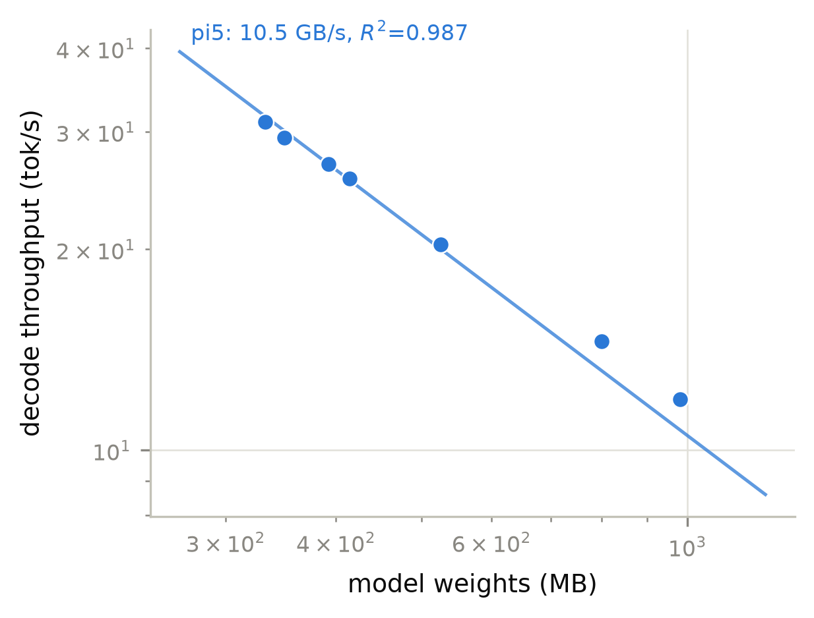
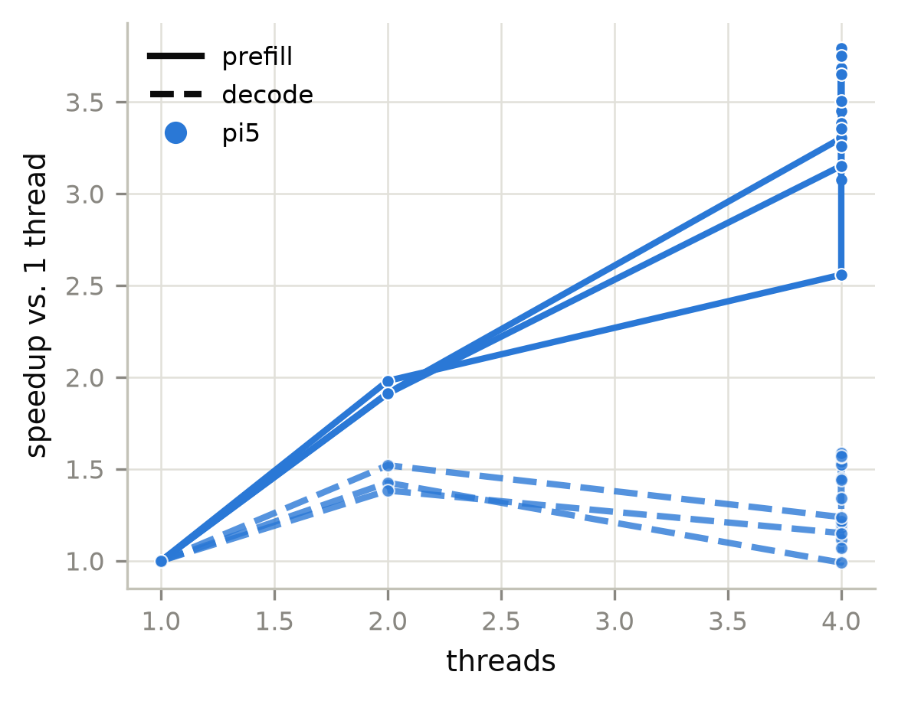
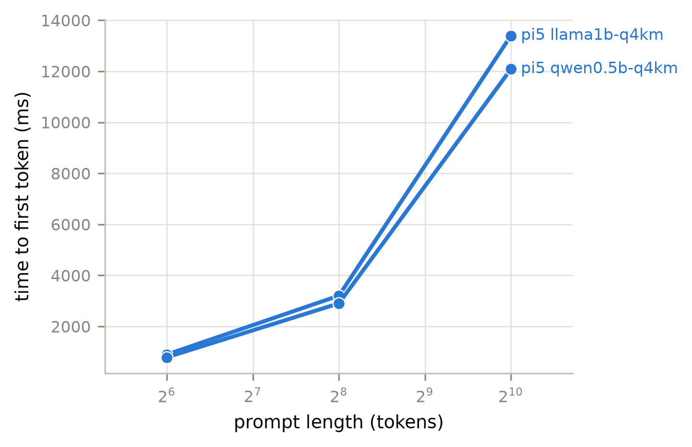
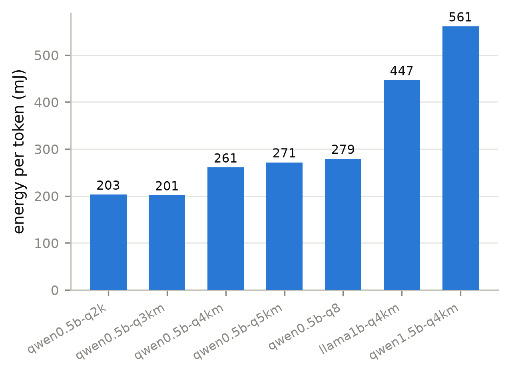
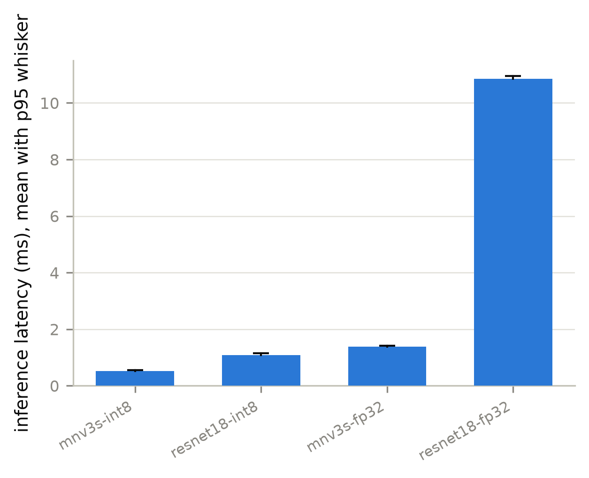

# Benchmark report

## Devices

**Devices under test**

| device | cpu | arch | cores | RAM GB | DRAM peak GB/s | runs |
|---|---|---|---|---|---|---|
| pi5 | Raspberry Pi 5 Model B Rev 1.0 | aarch64 | 4 | 2.11 | 13.98 | 43 |

## Throughput

**LLM decode and prefill throughput**

| device | model | quant | thr | MB | prefill t/s | decode t/s | GB/s | % peak | W | C |
|---|---|---|---|---|---|---|---|---|---|---|
| pi5 | qwen0.5b-q2k | Q2_K | 4 | 332.7 | 150.1 | 30.21 | 10.05 | 71.89 | 6.13 | 57.30 |
| pi5 | qwen0.5b-q2k | Q2_K | 4 | 332.7 | 151.9 | 31.02 | 10.32 | 73.80 | - | 59.50 |
| pi5 | qwen0.5b-q3km | Q3_K_M | 4 | 349.5 | 203.6 | 29.38 | 10.27 | 73.44 | - | 59.50 |
| pi5 | qwen0.5b-q3km | Q3_K_M | 4 | 349.5 | 204.3 | 28.78 | 10.06 | 71.95 | 5.80 | 58.40 |
| pi5 | qwen0.5b-q4km | Q4_K_M | 1 | 391.9 | 24.18 | 16.92 | 6.63 | 47.42 | - | 54.55 |
| pi5 | qwen0.5b-q4km | Q4_K_M | 2 | 391.9 | 47.89 | 25.72 | 10.08 | 72.10 | - | 57.30 |
| pi5 | qwen0.5b-q4km | Q4_K_M | 4 | 391.9 | 61.86 | 20.95 | 8.21 | 58.71 | - | 66.65 |
| pi5 | qwen0.5b-q4km | Q4_K_M | 4 | 391.9 | 81.88 | 24.55 | 9.62 | 68.82 | - | 64.45 |
| pi5 | qwen0.5b-q4km | Q4_K_M | 4 | 391.9 | 89.06 | 26.73 | 10.48 | 74.93 | - | 65.55 |
| pi5 | qwen0.5b-q4km | Q4_K_M | 4 | 391.9 | 91.10 | 26.08 | 10.22 | 73.11 | 6.80 | 61.70 |
| pi5 | qwen0.5b-q4km | Q4_K_M | 4 | 391.9 | 79.90 | 26.74 | 10.48 | 74.97 | - | 68.85 |
| pi5 | qwen0.5b-q4km | Q4_K_M | 4 | 391.9 | 90.67 | 26.51 | 10.39 | 74.31 | - | 63.35 |
| pi5 | qwen0.5b-q4km | Q4_K_M | 4 | 391.9 | 91.58 | 26.73 | 10.47 | 74.92 | - | 60.60 |
| pi5 | qwen0.5b-q4km | Q4_K_M | 4 | 391.9 | 91.68 | 26.83 | 10.51 | 75.20 | - | 64.45 |
| pi5 | qwen0.5b-q4km | Q4_K_M | 4 | 391.9 | 90.74 | 26.60 | 10.42 | 74.55 | - | 60.60 |
| pi5 | qwen0.5b-q5km | Q5_K_M | 4 | 414.1 | 80.83 | 25.05 | 10.38 | 74.21 | 6.80 | 62.25 |
| pi5 | qwen0.5b-q5km | Q5_K_M | 4 | 414.1 | 81.32 | 25.51 | 10.56 | 75.57 | - | 61.70 |
| pi5 | qwen0.5b-q8 | Q8_0 | 4 | 525.1 | 260.3 | 20.33 | 10.68 | 76.38 | - | 59.50 |
| pi5 | qwen0.5b-q8 | Q8_0 | 4 | 525.1 | 256.8 | 19.52 | 10.25 | 73.32 | 5.45 | 60.60 |
| pi5 | llama1b-q4km | Q4_K_M | 1 | 799.9 | 23.15 | 10.21 | 8.17 | 58.41 | - | 54.55 |
| pi5 | llama1b-q4km | Q4_K_M | 2 | 799.9 | 44.31 | 14.55 | 11.64 | 83.26 | - | 57.30 |
| pi5 | llama1b-q4km | Q4_K_M | 4 | 799.9 | 75.54 | 12.25 | 9.80 | 70.10 | 5.47 | 60.60 |
| pi5 | llama1b-q4km | Q4_K_M | 4 | 799.9 | 77.21 | 12.40 | 9.92 | 70.95 | - | 59.50 |
| pi5 | qwen1.5b-q4km | Q4_K_M | 1 | 980.1 | 16.84 | 8.63 | 8.46 | 60.48 | - | 55.65 |
| pi5 | qwen1.5b-q4km | Q4_K_M | 2 | 980.1 | 32.18 | 11.93 | 11.69 | 83.64 | - | 58.95 |
| pi5 | qwen1.5b-q4km | Q4_K_M | 4 | 980.1 | 53.07 | 9.93 | 9.73 | 69.62 | - | 60.05 |
| pi5 | qwen1.5b-q4km | Q4_K_M | 4 | 980.1 | 54.91 | 9.22 | 9.04 | 64.64 | 5.17 | 61.15 |

## Decode roofline

**Decode roofline: tokens per second against inverse model size**

| device | points | effective GB/s | R^2 | DRAM peak GB/s | % of peak |
|---|---|---|---|---|---|
| pi5 | 7 | 10.52 | 0.99 | 13.98 | 75.22 |

## Thread scaling

**Thread scaling, relative to the lowest thread count measured**

| device | model | threads | prefill t/s | decode t/s | prefill speedup | decode speedup |
|---|---|---|---|---|---|---|
| pi5 | llama1b-q4km | 1 | 23.15 | 10.21 | 1.00 | 1.00 |
| pi5 | llama1b-q4km | 2 | 44.31 | 14.55 | 1.91 | 1.43 |
| pi5 | llama1b-q4km | 4 | 76.45 | 10.11 | 3.30 | 0.99 |
| pi5 | llama1b-q4km | 4 | 71.19 | 12.08 | 3.08 | 1.18 |
| pi5 | llama1b-q4km | 4 | 75.54 | 12.25 | 3.26 | 1.20 |
| pi5 | llama1b-q4km | 4 | 77.21 | 12.40 | 3.34 | 1.21 |
| pi5 | llama1b-q4km | 4 | 79.91 | 11.41 | 3.45 | 1.12 |
| pi5 | qwen0.5b-q2k | 4 | 150.1 | 30.21 | 1.00 | 1.00 |
| pi5 | qwen0.5b-q2k | 4 | 151.9 | 31.02 | 1.01 | 1.03 |
| pi5 | qwen0.5b-q3km | 4 | 203.6 | 29.38 | 1.00 | 1.00 |
| pi5 | qwen0.5b-q3km | 4 | 204.3 | 28.78 | 1.00 | 0.98 |
| pi5 | qwen0.5b-q4km | 1 | 24.18 | 16.92 | 1.00 | 1.00 |
| pi5 | qwen0.5b-q4km | 2 | 47.89 | 25.72 | 1.98 | 1.52 |
| pi5 | qwen0.5b-q4km | 4 | 61.86 | 20.95 | 2.56 | 1.24 |
| pi5 | qwen0.5b-q4km | 4 | 81.88 | 24.55 | 3.39 | 1.45 |
| pi5 | qwen0.5b-q4km | 4 | 89.06 | 26.73 | 3.68 | 1.58 |
| pi5 | qwen0.5b-q4km | 4 | 91.10 | 26.08 | 3.77 | 1.54 |
| pi5 | qwen0.5b-q4km | 4 | 79.90 | 26.74 | 3.30 | 1.58 |
| pi5 | qwen0.5b-q4km | 4 | 81.09 | 25.77 | 3.35 | 1.52 |
| pi5 | qwen0.5b-q4km | 4 | 88.23 | 24.39 | 3.65 | 1.44 |
| pi5 | qwen0.5b-q4km | 4 | 90.67 | 26.51 | 3.75 | 1.57 |
| pi5 | qwen0.5b-q4km | 4 | 91.58 | 26.73 | 3.79 | 1.58 |
| pi5 | qwen0.5b-q4km | 4 | 84.73 | 22.65 | 3.50 | 1.34 |
| pi5 | qwen0.5b-q4km | 4 | 91.68 | 26.83 | 3.79 | 1.59 |
| pi5 | qwen0.5b-q4km | 4 | 90.74 | 26.60 | 3.75 | 1.57 |
| pi5 | qwen0.5b-q5km | 4 | 80.83 | 25.05 | 1.00 | 1.00 |
| pi5 | qwen0.5b-q5km | 4 | 81.32 | 25.51 | 1.01 | 1.02 |
| pi5 | qwen0.5b-q8 | 4 | 260.3 | 20.33 | 1.00 | 1.00 |
| pi5 | qwen0.5b-q8 | 4 | 256.8 | 19.52 | 0.99 | 0.96 |
| pi5 | qwen1.5b-q4km | 1 | 16.84 | 8.63 | 1.00 | 1.00 |
| pi5 | qwen1.5b-q4km | 2 | 32.18 | 11.93 | 1.91 | 1.38 |
| pi5 | qwen1.5b-q4km | 4 | 53.07 | 9.93 | 3.15 | 1.15 |
| pi5 | qwen1.5b-q4km | 4 | 54.91 | 9.22 | 3.26 | 1.07 |

## Quantisation

**Quantisation frontier**

| device | model | quant | MB | decode t/s | GB/s | mJ/token |
|---|---|---|---|---|---|---|
| pi5 | qwen0.5b-q2k | Q2_K | 332.7 | 31.02 | 10.32 | - |
| pi5 | qwen0.5b-q3km | Q3_K_M | 349.5 | 29.38 | 10.27 | - |
| pi5 | qwen0.5b-q4km | Q4_K_M | 391.9 | 26.83 | 10.51 | - |
| pi5 | qwen0.5b-q5km | Q5_K_M | 414.1 | 25.51 | 10.56 | - |
| pi5 | qwen0.5b-q8 | Q8_0 | 525.1 | 20.33 | 10.68 | - |
| pi5 | llama1b-q4km | Q4_K_M | 799.9 | 14.55 | 11.64 | - |
| pi5 | qwen1.5b-q4km | Q4_K_M | 980.1 | 11.93 | 11.69 | - |

## Latency

**Single-request latency**

| device | model | prompt tok | output tok | TTFT ms | e2e ms | decode t/s | implied prefill t/s |
|---|---|---|---|---|---|---|---|
| pi5 | llama1b-q4km | 64 | 64 | 898.9 | 6,124 | 12.08 | 71.19 |
| pi5 | llama1b-q4km | 256 | 64 | 3,203 | 8,749 | 11.41 | 79.91 |
| pi5 | llama1b-q4km | 1024 | 64 | 13,395 | 19,611 | 10.11 | 76.45 |
| pi5 | qwen0.5b-q4km | 64 | 64 | 789.2 | 3,235 | 25.77 | 81.09 |
| pi5 | qwen0.5b-q4km | 256 | 64 | 2,901 | 5,484 | 24.39 | 88.23 |
| pi5 | qwen0.5b-q4km | 1024 | 64 | 12,086 | 14,906 | 22.65 | 84.73 |

## Energy

**Power and energy**

| device | model | quant | thr | W total | W core | W DRAM | DRAM % | mJ/token | C |
|---|---|---|---|---|---|---|---|---|---|
| pi5 | llama1b-q4km | Q4_K_M | 4 | 5.47 | 3.71 | 0.24 | 4.43 | 446.6 | 60.60 |
| pi5 | qwen0.5b-q2k | Q2_K | 4 | 6.13 | 4.39 | 0.25 | 4.09 | 202.8 | 57.30 |
| pi5 | qwen0.5b-q3km | Q3_K_M | 4 | 5.80 | 4.05 | 0.25 | 4.39 | 201.4 | 58.40 |
| pi5 | qwen0.5b-q4km | Q4_K_M | 4 | 6.80 | 5.07 | 0.24 | 3.49 | 260.6 | 61.70 |
| pi5 | qwen0.5b-q5km | Q5_K_M | 4 | 6.80 | 5.06 | 0.24 | 3.56 | 271.5 | 62.25 |
| pi5 | qwen0.5b-q8 | Q8_0 | 4 | 5.45 | 3.68 | 0.26 | 4.76 | 279.1 | 60.60 |
| pi5 | qwen1.5b-q4km | Q4_K_M | 4 | 5.17 | 3.45 | 0.21 | 4.13 | 561.0 | 61.15 |

## Vision

**ONNX Runtime inference latency**

| device | model | quant | shape | thr | mean ms | p50 | p95 | p99 | inf/s | W |
|---|---|---|---|---|---|---|---|---|---|---|
| pi5 | mnv3s-fp32 | fp32 | 1x3x32x32 | 4 | 1.38 | 1.37 | 1.41 | 1.43 | 724.7 | - |
| pi5 | mnv3s-fp32 | fp32 | 1x3x32x32 | 1 | 1.98 | 1.98 | 2.01 | 2.02 | 504.5 | - |
| pi5 | mnv3s-int8 | int8 | 1x3x32x32 | 4 | 0.52 | 0.52 | 0.55 | 0.55 | 1,902 | - |
| pi5 | mnv3s-int8 | int8 | 1x3x32x32 | 1 | 0.57 | 0.57 | 0.60 | 0.60 | 1,747 | - |
| pi5 | mnv3s-int8 | int8 | 1x3x32x32 | 4 | 0.55 | 0.53 | 0.62 | 0.74 | 1,829 | - |
| pi5 | resnet18-fp32 | fp32 | 1x3x32x32 | 4 | 12.78 | 12.74 | 13.14 | 13.29 | 78.23 | - |
| pi5 | resnet18-fp32 | fp32 | 1x3x32x32 | 1 | 10.86 | 10.85 | 10.95 | 11.03 | 92.05 | - |
| pi5 | resnet18-int8 | int8 | 1x3x32x32 | 4 | 1.10 | 1.09 | 1.14 | 1.16 | 904.7 | - |
| pi5 | resnet18-int8 | int8 | 1x3x32x32 | 1 | 1.30 | 1.29 | 1.32 | 1.34 | 769.3 | - |
| pi5 | resnet18-int8 | int8 | 1x3x32x32 | 4 | 1.09 | 1.07 | 1.16 | 1.37 | 914.5 | - |

## Figures

